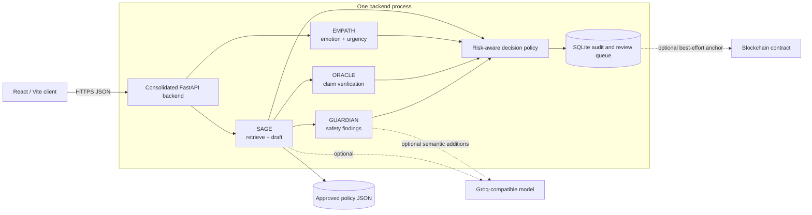

# AgentMesh Architecture

## Purpose and trust boundary

AgentMesh is a risk-aware support pipeline, not a group of independent chatbots voting on prose. Each role produces a different kind of evidence. A deterministic decision policy then decides whether the SAGE-authored draft can be returned, rewritten without changing its facts, blocked, or placed in a prototype review queue.

The backend trusts application-controlled policy records and deterministic rules. It treats customer input, model output, model-provided citations, and RPC responses as untrusted until validated. Prototype reviewer edits are explicit operator actions protected by a shared key; they are stored but are not automatically rerun through safety or evidence verification.

## Default topology



Docker Compose and Render both deploy only this backend service. The frontend is built and hosted separately. SQLite is mounted on writable persistent storage in those deployment paths.

### Explicit non-features

- Redis is not in the request path.
- The role components do not communicate over a message bus or service-to-service HTTP in consolidated mode.
- The decision engine is not PBFT or Byzantine fault tolerant.
- GUARDIAN, EMPATH, and ORACLE do not pretend to author independent customer answers.
- The UI does not stream a live debate; it renders a decision trace after the API responds.
- An escalation record enters a prototype queue. It does not notify or assign a real bank employee.

## Processing sequence

1. FastAPI validates the request, enforces `QUERY_MAX_LENGTH`, and applies the configured in-process rate limit.
2. SAGE retrieves application-controlled policy chunks from `KNOWLEDGE_BASE_PATH`.
3. SAGE produces a draft answer whose citations refer to retrieved identifiers, not model-invented source names.
4. GUARDIAN scans both the query and draft. Deterministic findings are preserved; optional semantic findings may add risk but cannot remove or downgrade them.
5. ORACLE extracts material claims and checks them against the exact source chunks retrieved in step 2.
6. EMPATH estimates emotion, sentiment, urgency, churn risk, and a response strategy.
7. The decision engine applies the fixed precedence described below.
8. If safe and supported, the backend may adapt presentation to the recommended tone while preserving verified factual content.
9. Decisions requiring review create a SQLite escalation ticket. The backend then writes the primary SQLite decision record with a disabled or pending optional-audit status. These are sequential writes, not one cross-record transaction; a decision-log failure is surfaced and prevents normal approval.
10. Only after the local decision exists, and only when explicitly enabled, the audit layer attempts a blockchain anchor, distinguishes submitted/confirmed/failed outcomes, and updates the SQLite record. It cannot change the decision, but it can add response latency while waiting for a receipt; it is disabled by default.

## Role contracts

The names are product roles inside one process. Outputs are typed and validated before the decision engine uses them.

### SAGE — policy grounding and draft generation

| Field | Meaning |
| --- | --- |
| `answer` | Customer-facing draft authored from retrieved policy. |
| `confidence` | Bounded estimate, not proof of correctness. |
| `citations` | Application-controlled references to retrieved sources. |
| `retrieval_quality` | Quality/coverage signal for the retrieved evidence. |
| `insufficient_data` | Explicit indicator that policy evidence cannot support a reliable answer. |

### GUARDIAN — safety and policy enforcement

| Field | Meaning |
| --- | --- |
| `status` | Validated safety severity such as safe, warning, or critical. |
| `violations` | Deduplicated deterministic and semantic findings with provenance. |
| `action` | Recommended safe handling. |
| `reasoning` | Concise decision-facing explanation. |
| `confidence` | Bounded classification signal. |
| `blocking` | Whether a veto-capable rule prevents normal approval. |

Deterministic credential, verification-bypass, prompt-injection, phishing, fraud, and unsafe-action rules are evaluated in code. Semantic analysis can add findings. It cannot erase deterministic findings or lower their severity.

### EMPATH — customer-state analysis

| Field | Meaning |
| --- | --- |
| `emotion` | Dominant detected emotion. |
| `urgency` | Normalized urgency signal. |
| `sentiment_label` | Validated sentiment class. |
| `sentiment_score` | Normalized sentiment confidence/signal. |
| `recommended_tone` | Presentation strategy for the response. |
| `churn_risk` | Risk signal for review/prioritization. |

EMPATH affects presentation and escalation priority, not factual truth. Tone adaptation cannot add policy claims, amounts, timelines, or guarantees.

### ORACLE — evidence verification

| Field | Meaning |
| --- | --- |
| `claims` | Claim-level support records, including controlled source IDs and reasons. |
| `overall_supported` | Whether all material claims are supported. |
| `unsupported_claims` | Material claims without adequate retrieved evidence. |
| `confidence` | Bounded verification signal. |
| `recommendation` | Approve, clarify, or escalate recommendation used as evidence by the policy. |

The current verifier uses transparent lexical coverage plus exact numeric matching against retrieved chunks. Those signals are evidence heuristics, not proof of truth. Unsupported material claims are veto-capable.

## Deterministic decision precedence

The first applicable safety condition wins; there is no score averaging that can cancel a veto.

```text
required policy/store/component unavailable
    -> SYSTEM_UNAVAILABLE (or ESCALATED if a safe review record can be created)

GUARDIAN deterministic critical violation
    -> BLOCKED, with escalation for high-risk follow-up when applicable

ORACLE unsupported material claim
    -> ESCALATED or NEEDS_CLARIFICATION

SAGE insufficient evidence
    -> NEEDS_CLARIFICATION

safe and grounded, but tone/presentation needs adaptation
    -> APPROVED_WITH_REWRITE

otherwise
    -> APPROVED
```

The response author remains SAGE. GUARDIAN supplies constraints, ORACLE supplies evidence findings, and EMPATH supplies a presentation strategy.

## Persistence and review workflow

SQLite is the primary audit and escalation system. Its location is configured with `DATABASE_PATH` and must be on writable persistent storage in a deployed environment.

An escalation record includes, at minimum:

- ticket and session identifiers;
- customer query and SAGE draft;
- reason, priority, status, and timestamps;
- serialized role findings and supporting citations;
- reviewer disposition and edited response when supplied.

The API supports listing and reading tickets plus prototype review actions such as approve, edit/resolve, and reject. Review endpoints are protected by `REVIEW_API_KEY` supplied in the `X-Review-API-Key` header. This shared-secret mechanism is sufficient only for a controlled demonstration; it does not provide individual accountability, RBAC, or production-grade authentication. If the variable is empty, the prototype currently permits review access, so shared deployments must always set it.

Reviewer edits and status changes are stored as prototype operator actions. The current queue does not enforce a transition state machine, keep an immutable per-reviewer action ledger, or automatically rerun edited prose through GUARDIAN and ORACLE.

Customer messages and decision traces can contain sensitive text. Operators are responsible for retention, access control, redaction, backup, and deletion policies before using any real data.

## Health and degradation

| Check or dependency | Behavior |
| --- | --- |
| `GET /healthz` | Process liveness only. It should remain inexpensive and not call optional networks. |
| `GET /readyz` | Verifies the policy source and writable SQLite path needed for valid decisions. Returns non-success when a mandatory dependency is unusable. |
| Hosted model unavailable | Use the implemented local deterministic/extractive path or return a non-approved state; never fabricate verification. |
| GUARDIAN unavailable/invalid | Fail closed; do not approve. |
| ORACLE unavailable/invalid | Do not label a response verified. |
| EMPATH unavailable/invalid | Use neutral tone; do not alter facts. |
| Policy retrieval unavailable | Return `SYSTEM_UNAVAILABLE` or `NEEDS_CLARIFICATION`. |
| Blockchain unavailable | Continue processing and expose a failed/disabled audit-anchor status. |

Rate limiting is in memory and therefore per process. SQLite plus a single attached disk also constrains the default deployment to one instance. A production scale-out would require an external database and shared rate-limit state.

## Security controls

- Query length and typed request validation limit malformed or abusive input.
- CORS origins are explicit and environment-configured.
- Deterministic critical findings have precedence over model output.
- Model JSON is parsed into strict application schemas and safe fallback states.
- Evidence identifiers and text originate from the application-controlled policy corpus.
- Review operations require a server-side key; browser exposure of that key is acceptable only for an isolated prototype demonstration and is not a production pattern.
- Blockchain keys and credential-bearing RPC URLs remain server-side and should never be logged.
- API errors should expose stable categories without stack traces or secrets.

## Audit model

The SQLite record is authoritative because it can capture all decision states and reviewer actions without an external network. Optional blockchain anchoring stores or submits a compact cryptographic reference only when enabled. Internally, SQLite may briefly hold a pending status while the optional call runs; the API distinguishes disabled, submitted, confirmed, and failed outcomes. Network unavailability is reported as a failure, and a transaction hash alone is not described as confirmation.

The included Solidity contract and scripts are optional prototype artifacts. They are not evidence that a public network deployment exists or that the contract meets production authorization, privacy, upgrade, or key-management requirements.

## Deployment consequences

- The Docker image contains the approved sample policy file; Compose mounts only `/app/state` for runtime writes.
- Render attaches a 1 GB disk at `/app/state` and uses `/readyz` as the deployment health check.
- A persistent disk requires a compatible paid Render service and prevents horizontal scaling and zero-downtime deploys for that service.
- The static frontend must be configured with the public API base, while backend `CORS_ORIGINS` must contain the exact frontend origin.

See [DEPLOY.md](DEPLOY.md) for setup and smoke checks.

## Future architecture

A production evolution would use authenticated reviewers, an external relational database, centrally managed policy versions, distributed throttling, durable job processing, observability, data-loss prevention, and explicit integrations with approved case-management systems. Those are future boundaries, not hidden dependencies of the hackathon workflow.
