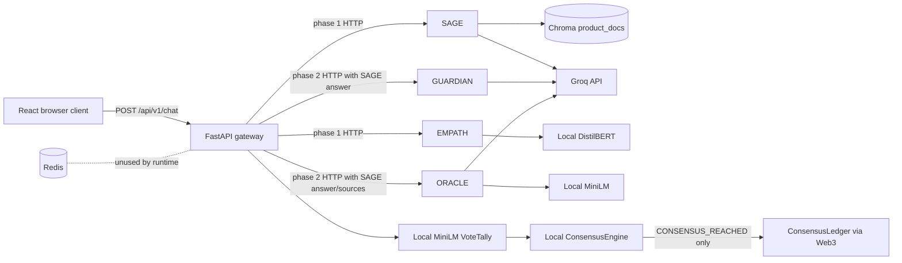
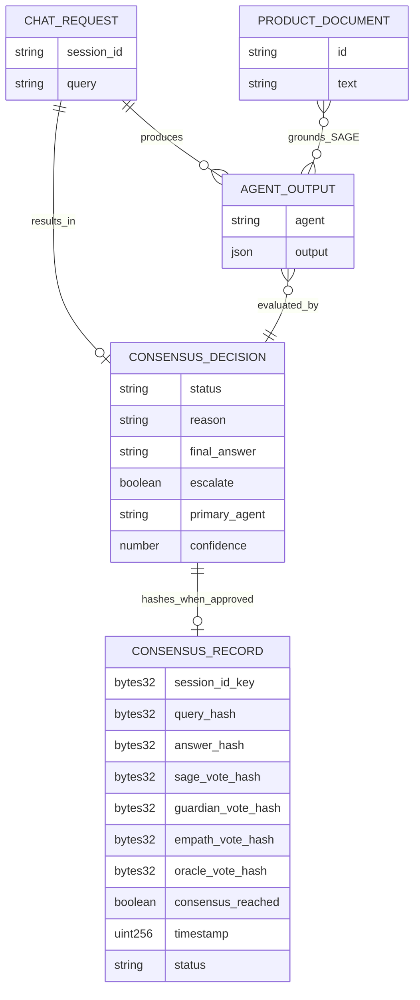
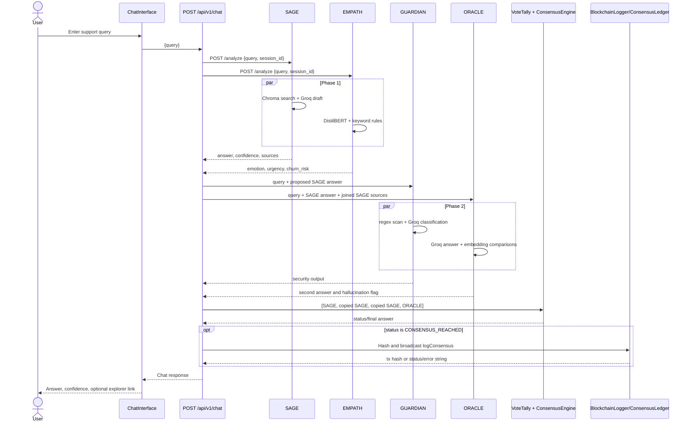
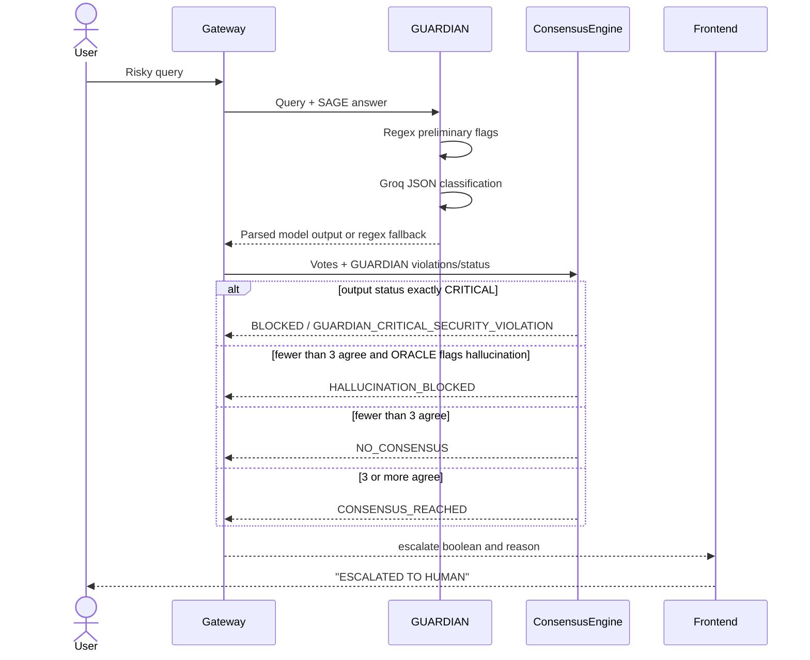

# Codebase Context

> **Historical baseline:** Sections below document the repository before the July 2026 repair. The implementation has since been consolidated and corrected. For current runtime behavior, contracts, commands, and limitations, treat `README.md`, `ARCHITECTURE.md`, `IMPLEMENTATION_REPORT.md`, source code, and tests as authoritative. This pre-repair analysis is retained to explain why the changes were made.

This document describes the repository as inspected on 2026-07-16. Runtime code, manifests, and tests are treated as authoritative when they conflict with prose documentation. No secret values were present or are reproduced here.

## 1. Executive Summary

AgentMesh is a hackathon-oriented prototype for bank/customer-support responses. A React client sends a query to a FastAPI gateway, which calls four nominally specialized FastAPI services:

- SAGE retrieves product-policy context from ChromaDB and asks a Groq-hosted Llama model to draft an answer.
- GUARDIAN applies regex security rules and asks the same Groq model to classify risk.
- EMPATH combines a Hugging Face sentiment model with keyword rules for emotion and urgency.
- ORACLE asks Groq for a second answer and compares embeddings to flag possible hallucination.

The gateway then runs a local threshol  d-based `ConsensusEngine` and, only for `CONSENSUS_REACHED`, attempts to hash the result into a Solidity contract. The frontend has a simple chat view and a simulated council/debate view. The main implementation is in `frontend/src/`, `api/`, `agents/`, `consensus/`, and `blockchain/`.

The repository is not currently runnable end to end and must not be treated as production-ready:

1. `agents/sage/main.py` and `agents/guardian/main.py` have confirmed Python syntax errors in their system-prompt string literals. Both containers fail before their FastAPI applications can start.
2. The implemented "PBFT" is not PBFT. It is an in-process 3-vote threshold, and the orchestrator supplies SAGE's answer as the SAGE, GUARDIAN, and EMPATH answers. Those three synthetic copies frequently guarantee agreement without three independent answers.
3. Parsed GUARDIAN LLM output replaces the deterministic regex decision instead of being constrained by it. A model response can therefore discard a deterministic critical flag.
4. `render.yaml` deploys only the gateway and Redis; it does not deploy any agent or ChromaDB service. The gateway's hard-coded agent hostnames cannot work in that topology.
5. There is no authentication, authorization, rate limiting, input-length limit, human-escalation integration, conversation persistence, or production monitoring.
6. Nine isolated consensus/scanner tests passed locally. The two integration tests failed because their hard-coded Docker hostname `gateway` was not resolvable with no stack running. The checked-in CI runs those same integration tests without starting the stack, so its test job is structurally expected to fail. Static parsing also confirmed the two syntax failures above.

The evidence in `AGENTMESH_BUILD_SPEC.md`, placeholder team and clone data in `README.md`, and the feature gaps classify this repository as an incomplete hackathon demo/prototype, not an MVP or production application.

## 2. Product Purpose

### Intended problem and users

The intended problem is reducing unsafe or hallucinated responses from a single support chatbot in high-stakes domains. The sample knowledge base is bank-oriented: refunds, credential handling, card blocking, fraud escalation, and premium-account benefits in `data/product_docs.json`.

Likely target users, based on `README.md`, `ARCHITECTURE.md`, and `AGENTMESH_BUILD_SPEC.md`, are:

- customers asking banking support questions;
- support or risk teams that want unsafe queries escalated;
- demo judges or operators viewing the four-agent decision process;
- auditors following a transaction link to a blockchain record.

### Intended use cases

- Answer a policy question using a small product-document collection.
- Block credential requests, phishing urgency, or financial-manipulation language.
- Detect frustration/urgency and expose a recommended support tone.
- Compare a drafted answer with a second model answer and source context.
- Require three nominal agent agreements before returning a response.
- Hash approved decisions and agent outputs into `ConsensusLedger`.
- Display per-agent output, consensus state, and a Polygon explorer link.

### Actual scope

Only a synchronous request/response demo exists. There is no customer/account system, ticket system, human escalation queue, admin interface, durable chat history, identity layer, policy authoring flow, or audit-record retrieval API. The "live debate" is a client-side timed reveal after one completed `/chat` request, not streaming agent communication (`frontend/src/components/AgentDebateViewer.jsx`, component `AgentDebateViewer`).

## 3. Current Implementation Status

| Area | Status | Implementation evidence |
|---|---|---|
| Product concept and sample policies | Complete for a demo | `README.md`, `ARCHITECTURE.md`, `data/product_docs.json` |
| React shell and chat UI | Partially implemented | `frontend/src/App.jsx`; `frontend/src/components/ChatInterface.jsx` |
| Council visualization | Mocked presentation over real response data | `AgentDebateViewer.runSimulation` waits 800 ms between already-received agent outputs; there is no stream |
| Gateway routes | Partially implemented | `api/main.py`, `api/routes/chat.py`, `api/routes/health.py` |
| SAGE service | Broken | `agents/sage/main.py` fails Python parsing at its JSON prompt literal |
| GUARDIAN service | Broken and logically unsafe | `agents/guardian/main.py` fails parsing; when corrected, parsed model JSON can override regex flags |
| EMPATH service | Partially implemented | `agents/empath/main.py`, `EmotionAnalyzer.analyze`; deterministic emotion categories do not use the model's label to choose emotion |
| ORACLE service | Partially implemented | `agents/oracle/main.py`, `FactChecker`; receives model-provided `sources`, not the retrieved Chroma documents |
| Consensus | Hard-coded/mischaracterized | `api/services/orchestrator.py`, `consensus/pbft_consensus.py`; simple threshold over three duplicated SAGE answers plus ORACLE |
| Redis message bus | Disconnected/dead code | `consensus/message_bus.py` is never imported or instantiated by the runtime |
| Chroma RAG | Partially implemented, runtime unverified | `agents/sage/rag_engine.py`, `api/seed_docs.py`, `docker-compose.yml` |
| Blockchain write path | Partially implemented | `api/services/blockchain_logger.py`, `blockchain/contracts/ConsensusLedger.sol`; only approved decisions are attempted |
| Smart-contract authorization | Broken for trustworthy audit | `ConsensusLedger.logConsensus` is public and has no caller restriction |
| Authentication/RBAC | Not implemented | No auth dependency, middleware, user model, password, token, or protected route exists |
| Human escalation | Planned only | API returns `escalate: true`; there is no queue, webhook, ticket, or notification integration |
| Docker Compose | Defined but application startup is blocked | `docker-compose.yml`; configuration parses, but SAGE/GUARDIAN syntax failures prevent the intended stack |
| Render deployment | Disconnected/incomplete | `render.yaml` defines only gateway and Redis |
| Vercel frontend | Configured, not verified deployed | `frontend/vercel.json`; no deployment URL is checked in |
| Automated tests | Partial | `tests/`; only consensus branches and several regex rules have isolated coverage |
| CI | Broken as checked in | `.github/workflows/ci.yml` starts no gateway for integration tests and lint encounters syntax errors |

## 4. Technology Stack

| Layer | Technology | Version/configuration evidence | Actual use |
|---|---|---|---|
| Languages | Python, JavaScript/JSX, CSS, Solidity, YAML/JSON | Source extensions throughout repository | Python services; React client; Solidity audit contract |
| Gateway/agents | FastAPI | `fastapi==0.111.0` in each Python service requirements file | HTTP APIs in `api/main.py` and each `agents/*/main.py` |
| ASGI server | Uvicorn | `uvicorn[standard]==0.30.0`; Docker `CMD` entries | One process per service, port 5000 internally or 8000 for gateway |
| Validation | Pydantic 2 | `pydantic==2.7.0` | Request body models only; AI outputs are not schema-validated |
| External LLM | Groq Python SDK | `groq==0.9.0` in SAGE/GUARDIAN/ORACLE requirements | Hard-coded model `llama3-70b-8192`, temperature `0.1` |
| Vector store | ChromaDB server + thin client | `chromadb/chroma:latest` in `docker-compose.yml`; `chromadb-client==0.4.25` in `agents/sage/requirements.txt` | One `product_docs` collection |
| Embeddings | Sentence Transformers | `sentence-transformers==2.7.0`; model `all-MiniLM-L6-v2` | ORACLE comparisons and gateway vote tally |
| Sentiment | Hugging Face Transformers + PyTorch | `transformers==4.41.0`, `torch==2.3.0`; DistilBERT model in `agents/empath/emotion_model.py` | Sentiment label/score, plus keyword-based emotion logic |
| HTTP clients | Requests | `requests==2.31.0` in gateway/SAGE requirements | Gateway-to-agent calls, health checks, Chroma seed calls |
| Message bus/cache | Redis 7 | `redis:7-alpine`, `redis==5.0.0` | Container and unused `RedisMessageBus`; not in active request flow and not used as a cache |
| Blockchain client | Web3.py | `web3==6.15.0` | Signs and sends `logConsensus` transactions |
| Smart contracts | Solidity + Hardhat toolbox | Solidity `^0.8.19`; Hardhat `^2.20.0`; toolbox `^4.0.0` | One `ConsensusLedger` contract and deployment scripts |
| Frontend | React 18 + Vite 5 | `frontend/package.json` | Local component state, no router or external state manager |
| Containers | Docker Compose | `docker-compose.yml`, five Dockerfiles | Redis, Chroma, four agents, gateway |
| Hosting config | Render and Vercel | `render.yaml`, `frontend/vercel.json` | Configuration only; no verified deployment |
| CI | GitHub Actions | `.github/workflows/ci.yml` | Pytest and Flake8 jobs, currently structurally broken |
| Tests | Pytest | Tests import `pytest`; CI installs it | Unit-style consensus/scanner tests and environment-dependent HTTP smoke tests |
| Package managers | pip and npm | Five `requirements.txt` files; two `package.json` files | No Python or npm lock files are checked in |

There is no relational/document application database, ORM, migration framework, message-queue worker, scheduler, server-side session store, authentication provider, agent framework, or frontend state-management library.

## 5. Repository Structure

```text
AgentMesh/
├── .github/workflows/ci.yml       # Pytest and Flake8 CI
├── agents/
│   ├── sage/                      # Chroma retrieval + Groq answer (currently syntax-broken)
│   ├── guardian/                  # Regex + Groq security classification (syntax-broken)
│   ├── empath/                    # DistilBERT sentiment + keyword emotion rules
│   └── oracle/                    # Groq second answer + embedding comparisons
├── api/
│   ├── main.py                    # Gateway FastAPI entry point and CORS
│   ├── routes/                    # /chat and /health
│   ├── services/                  # Orchestration and blockchain writer
│   ├── seed_docs.py               # Chroma seed script
│   ├── Dockerfile
│   └── requirements.txt
├── blockchain/
│   ├── contracts/ConsensusLedger.sol
│   ├── scripts/deploy.js
│   ├── scripts/start-local.js
│   ├── hardhat.config.js
│   └── package.json
├── consensus/
│   ├── pbft_consensus.py          # In-process threshold decision
│   ├── vote_tally.py              # Embedding-similarity vote labels
│   └── message_bus.py             # Unused Redis pub/sub wrapper
├── data/product_docs.json         # Five banking policy snippets
├── frontend/
│   ├── src/App.jsx
│   ├── src/components/            # Chat, council, and two unused proof components
│   ├── src/index.css
│   ├── src/main.jsx
│   ├── package.json
│   ├── vite.config.js
│   └── vercel.json
├── tests/                         # Consensus, regex, and Docker-host smoke tests
├── AGENTMESH_BUILD_SPEC.md        # Original hackathon generation specification; non-authoritative
├── ARCHITECTURE.md                # Intended design, not an accurate runtime description
├── DEPLOY.md                      # Deployment instructions with incomplete topology
├── README.md                      # Product pitch and quick start
├── docker-compose.yml
└── render.yaml
```

### Directory and file authority

- `api/`, `agents/`, `consensus/`, `frontend/src/`, and `blockchain/` are the implementation.
- `docker-compose.yml`, the Dockerfiles, `render.yaml`, `frontend/vercel.json`, dependency manifests, and `.github/workflows/ci.yml` are authoritative for execution/deployment intent.
- `AGENTMESH_BUILD_SPEC.md` is a master prompt/scaffold for a FlowZint AI Hackathon 2026 submission. It embeds older copies of much of the repository. It is useful for intent but must not be edited as though it were runtime code.
- `ARCHITECTURE.md` claims Redis pub/sub, interchangeable consensus strategies, factory-based agent creation, independent agents, and production PBFT. None of those claims is implemented as described.
- `README.md` and `DEPLOY.md` contain placeholders and stale/conflicting network instructions. Code and manifests take precedence.
- `frontend/src/components/ConsensusBadge.jsx` and `frontend/src/components/BlockchainProof.jsx` are unused. Equivalent explorer-link markup is duplicated directly in `ChatInterface.jsx` and `AgentDebateViewer.jsx`.
- `consensus/message_bus.py` is unused. No generated source directories are tracked; `.gitignore` excludes Python caches, frontend builds, Hardhat artifacts/cache, coverage, virtual environments, dependencies, and environment files.

### Missing or divergent files

- The build specification calls for `.env.example`, but none exists. `.gitignore` uses `.env.*`, which would also ignore `.env.example` unless explicitly negated or force-added.
- The build-spec tree names `api/services/consensus_caller.py`; it is absent and not referenced by current code.
- `frontend/index.html` references `/vite.svg`, but no such asset is present.
- There are no npm lock files, Python lock files, database migrations, contract tests, frontend tests, or checked-in generated contract artifacts.

## 6. Application Architecture

### Actual runtime topology



The gateway uses direct HTTP service names from `AGENT_URLS` in `api/services/orchestrator.py`. Redis is not on this path. Consensus and blockchain submission occur inside the gateway process, not in independent services.

### Intended design versus implementation

| Documentation claim | Implementation |
|---|---|
| All four agents independently analyze each query | SAGE and EMPATH run first; GUARDIAN and ORACLE depend on SAGE. Only SAGE and ORACLE produce candidate answers. |
| Redis observer/pub-sub bus | Gateway calls fixed HTTP URLs; `RedisMessageBus` is unused. |
| PBFT tolerates one Byzantine agent | `ConsensusEngine.reach_consensus` counts string labels; there are no PBFT phases, node identities, signatures, replicated state, or Byzantine message handling. |
| Pluggable strategy/factory | `AgentOrchestrator.__init__` directly constructs one `ConsensusEngine` and one `VoteTally`; URLs and four agents are constants. |
| Every decision is immutably logged | `api/routes/chat.py:chat` logs only `CONSENSUS_REACHED`. Blocked/no-consensus paths are not logged. |
| Human escalation | Only a boolean/reason is returned. |

### Backend startup sequence

1. Docker builds the gateway with repository root as context using `api/Dockerfile`; it copies `api/`, `consensus/`, and `data/`, sets `/app/api` as the working directory, and launches `uvicorn main:app`.
2. `api/main.py` imports `routes.chat`. Importing `api/routes/chat.py` constructs process-global `AgentOrchestrator` and `BlockchainLogger` instances.
3. `AgentOrchestrator.__init__` constructs `VoteTally`, which loads `all-MiniLM-L6-v2` through `SentenceTransformer` during module import/startup (`consensus/vote_tally.py`). This may require a first-run model download.
4. `BlockchainLogger.__init__` reads blockchain environment variables and synchronously probes the configured RPC followed by three hard-coded Mumbai RPCs, each with a ten-second provider timeout (`api/services/blockchain_logger.py`).
5. `api/main.py` adds permissive CORS middleware, registers chat and health routers under `/api/v1`, and defines `GET /`.
6. There are no FastAPI lifespan handlers, explicit readiness checks, shutdown hooks, background workers, scheduled jobs, or database migrations.

Agent containers launch `uvicorn main:app` from their own `/app` directories:

- SAGE would construct a Groq client and `RAGEngine` at import. `RAGEngine` contacts Chroma and gets or creates `product_docs`. A syntax error currently prevents this entire sequence (`agents/sage/main.py`).
- GUARDIAN would construct a Groq client, but a syntax error prevents import (`agents/guardian/main.py`).
- EMPATH constructs `EmotionAnalyzer`, which loads/downloads the DistilBERT pipeline at import (`agents/empath/main.py`, `agents/empath/emotion_model.py`).
- ORACLE constructs a Groq client and `FactChecker`, which loads/downloads MiniLM at import (`agents/oracle/main.py`, `agents/oracle/fact_checker.py`).

Compose waits for Redis and Chroma health before starting SAGE, but the gateway waits only for `service_started` on agents, not for working agent readiness (`docker-compose.yml`). None of the agent services has a Compose health check.

### Frontend startup sequence

1. `npm run dev` runs Vite on port 3000 (`frontend/package.json`, `frontend/vite.config.js`).
2. `frontend/index.html` loads `/src/main.jsx`.
3. `frontend/src/main.jsx` creates a React root in strict mode and renders `App`.
4. `App` uses local `useState` to switch between chat and council views. There is no router, server-side rendering, persistence, or global state provider.
5. Both request-producing components resolve `VITE_API_URL`, defaulting to `http://localhost:8000/api/v1`. Because this default is absolute, it bypasses Vite's configured `/api` proxy.

## 7. Frontend Architecture

### Component map

| Component | Purpose and state | API/data | Status/limitations |
|---|---|---|---|
| `App` in `frontend/src/App.jsx` | Header, `view`, and `activeSession`; switches chat/debate | Passes setter to chat and session ID to debate | `AgentDebateViewer` never uses `sessionId`, so `activeSession` has no effect |
| `ChatInterface` in `frontend/src/components/ChatInterface.jsx` | Local messages, input, loading; sends a query | `POST ${API_URL}/chat`; stores full response in message `meta` | No `res.ok` check, retry, cancellation, timeout, history persistence, session reuse, or input length validation |
| `AgentDebateViewer` in `frontend/src/components/AgentDebateViewer.jsx` | Query, four display cards, consensus | Calls the same `/chat`; maps `agent_votes` into display state | "Live" progress is a client-side delay after the complete response; session prop unused; confidence units/types are mishandled |
| `ConsensusBadge` | Minimal verified/proof link | Props only | Unused and link does not validate a transaction prefix or set external-link protections |
| `BlockchainProof` | Mumbai explorer link for `0x` hash | Props only | Unused; logic is duplicated elsewhere |

`frontend/src/index.css` provides a dark theme, card states, consensus colors, form controls, and message bubbles. Most layout styling is inline in components. The four-column council grid has no responsive breakpoint.

### Views and user journeys

There are no URL routes. `App` conditionally renders one of two views:

1. **Customer Chat**
   - User types a non-whitespace string and presses Send or Enter.
   - `ChatInterface.sendMessage` appends the user message, clears the input, and shows "Agent Council deliberating...".
   - It posts `{ "query": input }`; it never sends the session ID returned by earlier calls.
   - It displays `final_answer`, otherwise `consensus_reason`, otherwise `Processing...`.
   - For consensus, it claims "Verified by 4 Agents" even though the threshold is three and the votes are not independent.
   - For `escalate`, it displays a message, but no human is contacted.
   - A blockchain link appears only when `blockchain_tx` starts with `0x`.

2. **Live Council View**
   - User enters a separate query and calls `runSimulation`.
   - All four cards immediately change to `analyzing` while one ordinary `/chat` request runs.
   - After the full response arrives, cards are revealed at 800 ms intervals.
   - The displayed `vote` is recomputed heuristically in the browser, not returned by `VoteTally`; it can disagree with the backend's actual vote labels.
   - `EMPATH.sentiment_score` is 0–1 but is rounded and shown as a percent without multiplying by 100. ORACLE's `confidence` is the string `HIGH`, `MEDIUM`, or `LOW`, causing the numeric `> 0` display condition to fail. Missing numeric confidences fall back to a hard-coded 85.
   - Errors are only sent to `console.error`; the UI can remain in the analyzing state.

### Forms, validation, loading, and errors

- Form handling is custom React state; there is no form library or schema validator.
- Both views reject only locally blank strings. The gateway itself accepts empty strings and imposes no maximum.
- Chat disables its button while loading, but the input remains active. Council does not disable its button and can issue concurrent requests.
- `onKeyPress` in `ChatInterface` is a legacy React event API; no form submit semantics or accessibility labels are provided.
- Fetch response status is not checked. FastAPI `422`/`500` JSON can be treated as normal data and become `Processing...`.
- Chat catches network/JSON errors and displays their browser message. Council only logs them.
- No skeletons, progressive agent events, abort controller, retry UI, toast system, error boundary, or offline state exists.

### Hard-coded and disconnected frontend data

- Agent names, roles, colors, and fallback confidence 85 are hard-coded in `AgentDebateViewer.jsx`.
- Mumbai Polygonscan URLs are duplicated in three components.
- The API fallback points at the browser's `localhost`, which is appropriate only for local development.
- `/vite.svg` is referenced but absent.
- No component consumes health data. No UI retrieves an on-chain record.

## 8. Backend Architecture

### Gateway layer

- `api/main.py` is the composition root. It registers `chat_router` and `health_router` and configures CORS.
- `api/routes/chat.py` defines `ChatRequest` and the `chat` handler. It assigns a UUID when no `session_id` is supplied, delegates to `AgentOrchestrator.process`, conditionally calls `BlockchainLogger.log_consensus`, and shapes the public response.
- `api/routes/health.py` serially performs four blocking HTTP GETs. It always labels the gateway healthy and returns HTTP 200 even if all agents are unreachable. It does not check Redis, Chroma, Groq, model readiness, or blockchain connectivity.

### Service/orchestration layer

`AgentOrchestrator` in `api/services/orchestrator.py` is both workflow service and adapter:

1. `process` starts SAGE and EMPATH concurrently with `asyncio.gather`.
2. It extracts only SAGE's `output.answer` as the candidate answer.
3. It calls GUARDIAN and ORACLE concurrently, both using SAGE output.
4. It creates the answer list `[sage_answer, sage_answer, sage_answer, oracle_answer]`.
5. `VoteTally.calculate_agreement` embeds those strings and labels each by average cosine similarity.
6. It constructs four `AgentVote` objects. GUARDIAN and EMPATH are assigned SAGE's answer, not answers they authored.
7. It passes votes and GUARDIAN flags to `ConsensusEngine.reach_consensus` and returns a flattened result plus raw output dictionaries.

`call_agent` runs blocking `requests.post` in the default executor with a 15-second timeout. It does not call `raise_for_status`, validate the response structure, or retry. Any exception becomes an empty `output`, which lets downstream code continue with defaults instead of distinguishing unavailable agents.

### Consensus layer

- `VoteTally` in `consensus/vote_tally.py` embeds all answers with `all-MiniLM-L6-v2`. Average cosine similarity `>= 0.75` means `AGREE`, `>= 0.5` means `ABSTAIN`, otherwise `DISAGREE`.
- `ConsensusEngine` in `consensus/pbft_consensus.py` requires `2 * fault_tolerance + 1`, which is three for the configured `fault_tolerance=1`.
- Evaluation order is: GUARDIAN critical override; three or more `AGREE`; ORACLE hallucination flag; otherwise no consensus.
- When consensus is reached, `max(confidence)` chooses the answer and `primary_agent`. A SAFE GUARDIAN receives confidence 100 and can be reported as primary even though its answer was copied from SAGE.
- `total_agents` is stored but never used to validate vote count, unique identity, quorum membership, or threshold feasibility.

### Agent services

- SAGE: `Query` -> `analyze` -> `RAGEngine.search` -> Groq JSON request -> parsed output/fallback.
- GUARDIAN: `AnalyzeRequest` -> `scan_query`/`scan_answer` -> Groq JSON request -> parsed output/fallback.
- EMPATH: `Query` -> `EmotionAnalyzer.analyze` -> DistilBERT plus keyword rules.
- ORACLE: `CompareRequest` -> Groq answer -> `FactChecker.compare_answers` and `check_against_context`.

There is no repository/data-access abstraction. The only persistent services are Chroma and the blockchain contract. Redis has a wrapper but no active caller. There are no background tasks or webhooks.

## 9. API Reference

All endpoints are unauthenticated and have no authorization requirement.

### Gateway endpoints

| Method and route | Handler | Request | Response/purpose | Services/data | Validation and errors |
|---|---|---|---|---|---|
| `GET /` | `api/main.py:root` | None | `{ "message": "AgentMesh Gateway", "status": "operational" }` | None | Static liveness only |
| `GET /api/v1/health` | `api/routes/health.py:health_check` | None | `{ "gateway": "healthy", "agents": { name: agent JSON or {"status":"unreachable"} } }` | Calls every agent `/health` serially | Two-second timeout each; any error becomes `unreachable`; endpoint still returns 200/healthy |
| `POST /api/v1/chat` | `api/routes/chat.py:chat` | `ChatRequest { query: str, session_id?: str }` | Orchestrates agents and consensus; response shape below | Agent HTTP APIs, local embeddings/consensus, optional chain write | Pydantic returns 422 for missing/wrong `query`; empty/huge strings are accepted; orchestration/blockchain failures are not mapped to clear HTTP status codes |

Public chat response:

```json
{
  "session_id": "string",
  "query": "string",
  "final_answer": "string or null",
  "consensus_status": "CONSENSUS_REACHED | BLOCKED | HALLUCINATION_BLOCKED | NO_CONSENSUS",
  "consensus_reason": "string or null",
  "agent_votes": {
    "sage": {},
    "guardian": {},
    "empath": {},
    "oracle": {}
  },
  "escalate": false,
  "blockchain_tx": "0x... | status/error string | null",
  "primary_agent": "sage | guardian | empath | oracle | null",
  "confidence": "number or null"
}
```

`consensus_reason` is absent/`null` on successful consensus because the success result has no `reason`. `blockchain_tx` is `null` for non-consensus paths, a hash for a submitted transaction, or a string such as `BLOCKCHAIN_RPC_UNAVAILABLE`, `BLOCKCHAIN_CONTRACT_NOT_CONFIGURED`, `BLOCKCHAIN_WALLET_NOT_CONFIGURED`, or `BLOCKCHAIN_ERROR: ...`.

### Agent endpoints

| Service/route | Handler and input | Successful output | Dependencies/entities | Error cases |
|---|---|---|---|---|
| SAGE `POST /analyze` | `agents/sage/main.py:analyze`; `{query: str, session_id: str}` | `{agent:"sage", session_id, output:{answer, confidence, sources}}` by prompt convention | Chroma `product_docs`, Groq | Service currently cannot parse/import. Intended code catches retrieval errors into prompt text but does not catch Groq errors. JSON parse fallback uses raw model text, confidence 50, empty sources. No schema/type checks. |
| SAGE `GET /health` | `agents/sage/main.py:health` | `{status:"healthy", agent:"sage"}` | None checked | Unavailable while syntax error exists; otherwise does not verify Chroma/Groq |
| GUARDIAN `POST /analyze` | `agents/guardian/main.py:analyze`; `{session_id, query, proposed_answer?: ""}` | `{agent:"guardian", session_id, output:{status, violations, action, reasoning}}` by prompt convention | Regex scanner, Groq | Service currently cannot parse/import. Groq errors uncaught. Parsed arbitrary JSON replaces regex result. Parse fallback uses regex result. |
| GUARDIAN `GET /health` | `agents/guardian/main.py:health` | `{status:"healthy", agent:"guardian"}` | None checked | Unavailable while syntax error exists |
| EMPATH `POST /analyze` | `agents/empath/main.py:analyze`; `{query: str, session_id: str}` | `{agent:"empath", session_id, output:{emotion, urgency, sentiment_label, sentiment_score, recommended_tone, churn_risk}}` | Local DistilBERT | Pydantic 422; model/runtime errors uncaught; empty text behavior depends on pipeline |
| EMPATH `GET /health` | `agents/empath/main.py:health` | `{status:"healthy", agent:"empath"}` | None checked | Model must already have loaded for app import to complete |
| ORACLE `POST /analyze` | `agents/oracle/main.py:analyze`; `{session_id, query, sage_answer, context?: ""}` | `{agent:"oracle", session_id, output:{oracle_answer, similarity_to_sage, context_alignment, hallucination_flag, confidence, flags}}` | Groq, local MiniLM | Pydantic 422; Groq/embedding errors uncaught; `confidence` is categorical string, unlike other numeric confidence fields |
| ORACLE `GET /health` | `agents/oracle/main.py:health` | `{status:"healthy", agent:"oracle"}` | None checked | MiniLM must load before app import completes |

Every agent uses internal port 5000. Compose publishes SAGE/GUARDIAN/EMPATH/ORACLE as host ports 5001/5002/5003/5004 respectively (`docker-compose.yml`). These APIs are exposed directly on all host interfaces by the Compose port mappings.

## 10. Data Model

### Storage systems

AgentMesh has no application database and no ORM. There are three storage-like components:

1. **ChromaDB** stores the `product_docs` vector collection. `RAGEngine.__init__` gets or creates the collection, `search` queries it, and `add_documents` can add documents (`agents/sage/rag_engine.py`). No explicit metadata schema, embedding function, distance metric, tenant, or index configuration is set in code.
2. **Solidity contract storage** holds `ConsensusRecord` values keyed by a hashed session ID (`blockchain/contracts/ConsensusLedger.sol`).
3. **Redis** has a persistent Compose volume but stores no application state in the active implementation. `RedisMessageBus` can publish JSON but is unused (`consensus/message_bus.py`).

Queries, agent outputs, and consensus decisions exist only in process memory and HTTP responses. The frontend holds chat messages only in component state; a refresh discards them.

### Logical entity relationships

The following is a logical data-flow ER view. Only `PRODUCT_DOCUMENT` and `CONSENSUS_RECORD` are persistent; the other entities are transient and have no database foreign keys.



### Chroma collection and seed data

`data/product_docs.json` contains five objects with `id` and `text`:

- `refund_policy_1`
- `security_policy_1`
- `card_block_1`
- `fraud_report_1`
- `premium_benefits_1`

`api/seed_docs.py:seed` loads `/app/data/product_docs.json` and POSTs each item to a hard-coded Chroma v1 HTTP path. There is no idempotency handling beyond whatever Chroma provides, no delete/update flow, no metadata, no migration/version marker, and no assertion that seeding succeeded. Failures are printed and the loop continues. `RAGEngine.add_documents` is not used by the seed script.

The Compose volume `chroma_data` persists server state across ordinary container recreation. Deleting the volume loses the knowledge base. No backup/restore process exists.

### Contract schema and lifecycle

`ConsensusLedger.ConsensusRecord` contains seven hashes, one boolean, a block timestamp, and a free-form status string. The public mapping key is `keccak(session_id)`; `recordIds` is an append-only public array of those keys.

Constraints and indexes:

- The mapping provides key lookup; there are no secondary indexes.
- There are no enums or validation for `status`.
- `logConsensus` is public, so any address can write.
- Reusing a session ID overwrites the mapping value while still appending another copy of the key to `recordIds`.
- The contract stores no submitter/owner in the record and has no uniqueness constraint.
- `getRecord` and the automatically generated `records` getter expose records; `getTotalRecords` exposes array length.

The API attempts a record only after `CONSENSUS_REACHED`. It hashes the Python string representation of each vote dictionary, which is not a documented canonical serialization (`BlockchainLogger.log_consensus`). It submits the transaction and returns the transaction hash without waiting for a receipt or confirmation. A returned hash therefore means broadcast, not confirmed immutability.

### Consensus status transitions

There is no persisted state machine, but `ConsensusEngine.reach_consensus` has this deterministic evaluation order:

```text
GUARDIAN flags contain CRITICAL
    -> BLOCKED / escalate=true
else at least 3 vote labels are AGREE
    -> CONSENSUS_REACHED / escalate=false
else ORACLE has HALLUCINATION
    -> HALLUCINATION_BLOCKED / escalate=true
else
    -> NO_CONSENSUS / escalate=true
```

The ordering matters: if three copied SAGE-based votes agree, the function returns consensus before checking ORACLE's hallucination flag. WARNING GUARDIAN output has no direct state transition and can still end in consensus.

## 11. Core Workflows

### Workflow A: chat query and approved response



Implementation trace:

1. User action is handled by `ChatInterface.sendMessage` in `frontend/src/components/ChatInterface.jsx`.
2. The component sends no previous `session_id`, so each message normally becomes a new UUID in `api/routes/chat.py:chat`.
3. `AgentOrchestrator.process` calls SAGE and EMPATH concurrently.
4. SAGE retrieves three documents and constructs a Groq prompt in `agents/sage/main.py:analyze`; EMPATH analyzes the first 512 characters in `EmotionAnalyzer.analyze`.
5. GUARDIAN and ORACLE run only after the SAGE answer is available.
6. GUARDIAN scans the query and proposed answer; ORACLE produces another answer and runs cosine comparisons.
7. The gateway creates synthetic agreement inputs and calls `VoteTally.calculate_agreement`, then `ConsensusEngine.reach_consensus`.
8. `chat` attempts the blockchain write synchronously only for successful consensus.
9. The frontend appends a bot message. State is local and not persisted.

Important error paths:

- An agent network error is converted by `call_agent` into an empty `output`; it is not exposed as a service-unavailable status.
- Agent HTTP 4xx/5xx status is not checked. JSON error bodies may silently become empty outputs.
- SAGE retrieval errors are inserted into the LLM context as text, potentially eliciting an answer about the error.
- LLM and embedding failures inside agents return HTTP 500 because they are not caught.
- `VoteTally` or other gateway-internal failures return the default FastAPI 500.
- Blockchain setup/failure does not change consensus status. It is encoded in `blockchain_tx` while the HTTP response remains successful.
- The current syntax errors prevent this workflow from completing in the checked-in stack.

### Workflow B: security block or escalation



There is no actual human handoff. Also, `all_flags` is only guaranteed to drive the response if Groq output cannot be parsed. When Groq returns valid JSON, the model-provided `status` and `violations` become authoritative. A model can downgrade a regex-detected critical condition. This is confirmed by `agents/guardian/main.py:analyze` assignment to `output` and by `api/services/orchestrator.py:process` reading only that output.

### Workflow C: council visualization

`AgentDebateViewer.runSimulation` performs the same backend workflow once, waits for the complete response, then uses browser timers to reveal cards. No WebSocket, Server-Sent Events, polling endpoint, Redis subscription, or intermediate backend state is involved. Its reconstructed display vote is presentation-only and is not the `agreement_votes` list used by the backend.

### Workflow D: seed knowledge base

1. Operator runs `docker compose exec gateway python /app/api/seed_docs.py` as documented in `README.md`.
2. `seed` reads the mounted/copied JSON file at `/app/data/product_docs.json`.
3. It POSTs each document directly to `http://chromadb:8000/api/v1/collections/product_docs/documents`.
4. It prints status codes or exceptions and exits without a success/failure summary.

The Chroma collection is normally created by SAGE startup, so seeding assumes SAGE has already reached `RAGEngine.__init__`. The current SAGE syntax error prevents that creation. Compatibility of this hard-coded Chroma endpoint with the unpinned `chromadb/chroma:latest` image was not runtime-verified.

### Workflow E: health aggregation

`GET /api/v1/health` calls each agent sequentially and wraps any exception as unreachable. Worst-case latency is roughly four times the two-second timeout. It returns `gateway: healthy` regardless of dependencies, so it is a shallow status aggregation rather than a readiness check.

## 12. AI and Automation Architecture

### Model inventory

| Feature | Provider/model | Input and prompt | Output/validation | Settings and failure behavior |
|---|---|---|---|---|
| SAGE answer generation | Groq; hard-coded `llama3-70b-8192` | System says use only context, emit strict JSON, and say `INSUFFICIENT_DATA`; user message contains retrieved document text and query (`agents/sage/main.py`) | Requests Groq `json_object`; parses with `json.loads`; no Pydantic/JSON Schema/range validation; fallback wraps raw text with confidence 50 | Temperature 0.1; no max tokens, seed, retries, timeout, moderation, or alternate model; current prompt literal is invalid Python |
| GUARDIAN risk classification | Groq; same hard-coded model | System requests JSON status/violations/action/reasoning; user message includes query, SAGE answer, preliminary regex flags (`agents/guardian/main.py`) | Requests `json_object`; raw `json.loads`; no schema/enums; valid model JSON supersedes deterministic values | Temperature 0.1; no retries/fallback model; parse fallback uses regex; current prompt literal is invalid Python |
| EMPATH sentiment | Local Hugging Face `distilbert-base-uncased-finetuned-sst-2-english` | First 512 Python characters of query | Pipeline returns label/score; no explicit error handling | Default pipeline generation/inference settings; model is loaded at process import |
| EMPATH emotion/urgency | Deterministic keyword rules | Lowercased full query | Fixed emotion, urgency, tone, and churn threshold | This logic, not the transformer label, selects emotion and urgency |
| ORACLE second answer | Groq; same hard-coded model | System says answer only from context; user gets joined `SAGE.output.sources` and query (`agents/oracle/main.py`) | Free text; no structured output or validation | Temperature 0.1; no retries, fallback, or max tokens |
| ORACLE fact checks | Local `all-MiniLM-L6-v2` | SAGE vs ORACLE answer; SAGE answer vs context | Cosine floats; hallucination when answer similarity `<0.65` or context alignment `<0.5` | Thresholds hard-coded; no calibration/test data; empty context returns 0.0 |
| Consensus vote labels | Local `all-MiniLM-L6-v2` in gateway | Three SAGE copies and one ORACLE answer | Average cosine -> `AGREE`/`ABSTAIN`/`DISAGREE` | Threshold 0.75/0.5; no zero-norm guard or model failure handling |
| RAG embeddings | Chroma server's collection behavior | `query_texts=[query]`, `n_results=3` | `documents` list used as SAGE context | No embedding model is explicitly configured in client code; server/image defaults apply |

### Retrieval and grounding

`RAGEngine.search` is a thin Chroma query. SAGE uses the returned document text as prompt context. There is no chunking pipeline, metadata filtering, reranking, citations tied to stored IDs, tenant separation, freshness/versioning, or retrieval quality evaluation.

The `sources` field is generated by SAGE's LLM because the code does not replace it with the retrieved IDs/documents. The orchestrator passes `"\n".join(SAGE.output.sources)` to ORACLE. Consequently, ORACLE's "context alignment" can be based on model-created source strings rather than the actual knowledge-base text. This breaks the claimed independent grounding chain.

### Agent and memory behavior

- There is no agent framework, tool/function calling, planning loop, tool registry, or inter-agent dialogue.
- The two HTTP phases are a fixed deterministic workflow in `AgentOrchestrator.process`.
- There is no conversation memory. `session_id` is correlation data only and is not used to retrieve prior turns.
- Redis does not carry agent messages.
- There are no model retries, circuit breakers, token budgets, response caches, or provider fallbacks. `AGENTMESH_BUILD_SPEC.md` mentions Ollama only as a proposed fallback; there is no Ollama code or dependency.

### Deterministic, AI-generated, mocked, and planned logic

| Category | Implemented items |
|---|---|
| Deterministic | GUARDIAN regex scanners; EMPATH keyword emotion/urgency; cosine thresholding; consensus evaluation order; UUID generation; chain hashing |
| AI-generated | SAGE answer/confidence/sources; GUARDIAN final parsed classification when JSON parses; ORACLE second answer; EMPATH sentiment label/score |
| Mocked/presentation-only | Council animation timing and reconstructed UI votes; hard-coded missing confidence 85; "Verified by 4 Agents" label |
| Planned but absent | Real PBFT, Redis observer flow, weighted/pluggable consensus, human handoff, Ollama fallback, independently authored four answers, cryptographic vote verification |

### AI output effects and risks

- AI output is returned to users and can determine whether data is submitted to the contract. It does not directly mutate Chroma or other local records.
- SAGE/ORACLE prompts concatenate untrusted query text and retrieved/model-provided context without delimiters that enforce instruction hierarchy. Prompt injection can alter answers, fields, or claimed sources.
- GUARDIAN is itself vulnerable to prompt-injected/downgraded structured output because deterministic flags are not enforced after parsing.
- JSON object mode is not a schema. Confidence may be out of range, fields may be absent, and violations/status may have wrong types.
- Similarity is semantic resemblance, not factual verification. Two similarly worded false answers can pass; a correct differently worded answer can fail.
- The consensus's duplicated SAGE answers undermine independence and allow one model output to count three times.
- The consensus success branch precedes ORACLE hallucination handling, so a hallucination flag does not necessarily block an answer.
- External model availability and the continued validity of `llama3-70b-8192` were not checked against live Groq service state.

## 13. Authentication and Security

### Authentication and authorization status

There is no registration, login, password handling, token creation/validation, refresh token, cookie/session, role-based access control, API key check, service-to-service authentication, or protected endpoint. Every gateway and agent endpoint is public to any network that can reach its port. No user/account model exists.

`session_id` is not a security credential. A client may supply any string, including one used previously; it is neither signed nor ownership-checked.

### Security-control inventory

| Control | Status and evidence |
|---|---|
| CORS | `api/main.py` allows every origin, method, and header while enabling credentials. This is overly broad and should not be considered an access control. |
| Rate limiting/abuse prevention | Absent on costly Groq/model/blockchain endpoints |
| Input validation | Pydantic type checks only; no length, content, Unicode, or session-ID constraints |
| Output validation | AI JSON is not schema-validated; upstream HTTP JSON is trusted structurally |
| Input sanitization | No HTML/database interpolation occurs in current path, but prompts accept raw text and contract/hash/log error strings are unsanitized |
| Secret management | Environment variables are used; no secret is checked in. No `.env.example` exists. `PRIVATE_KEY` is passed into the gateway container. |
| Secret logging | `BlockchainLogger.__init__` prints the successful full RPC URL. An Alchemy/Infura URL can contain an API key, so this can leak credentials to logs. |
| TLS | Not configured in application/Compose; expected to be terminated by hosting platforms if deployed |
| File uploads | None |
| Database security | Chroma and Redis host ports are published with no application credentials in Compose |
| Service isolation | All four agent ports, Redis, and Chroma are exposed to the host; agent calls are unauthenticated HTTP |
| Error disclosure | Blockchain error text is returned in `blockchain_tx`; browser errors and default FastAPI trace behavior depend on runtime configuration |
| Dependency reproducibility | Python versions are pinned exactly but npm versions are ranges; no lock files; Chroma image uses `latest` |

### GUARDIAN-specific limits

`agents/guardian/security_scanner.py` is a small English regex list. It detects literal credential terms, urgency phrases, some PII requests, money-transfer phrases, refund promises, skipped verification, and policy override language. It does not normalize homoglyphs, punctuation insertion, encoded text, non-English language, or indirect/social-engineering variants.

Not all detected policy flags have business effects. `SKIPPING_VERIFICATION` and `POLICY_OVERRIDE` are collected but do not map to WARNING or CRITICAL in `agents/guardian/main.py`. WARNING does not force escalation in `ConsensusEngine`. Most importantly, parsed LLM output can discard all regex flags.

### Blockchain security

- `ConsensusLedger.logConsensus` lacks owner/role/signature checks, so an arbitrary chain account can forge or overwrite audit records.
- The contract does not bind `msg.sender` into `ConsensusRecord` and does not reject duplicate session IDs.
- Gateway transactions use a single private key and `get_transaction_count(wallet)` without `pending`. Concurrent requests or multiple gateway replicas can choose the same nonce.
- A fixed 10 gwei gas price and 200,000 gas limit are hard-coded. No dynamic fee strategy, chain-ID assertion, balance check, nonce lock, retry, receipt wait, or reorg/finality handling exists.
- Hashing protects plaintext from direct on-chain exposure but does not prove that the off-chain input was valid. Vote hashing uses non-canonical `str(dict)`.
- Only approved decisions are written, contradicting the "every decision" audit claim and omitting the riskiest blocked events.

### Privacy

The code does not persist raw queries in an application database, but it sends raw queries and retrieved policy context to Groq for SAGE/GUARDIAN/ORACLE. The repository does not define consent, redaction, retention, provider data-processing policy, or PII filtering before those calls. `ARCHITECTURE.md`'s claim that no PII is stored in agent logs is not enforced by code, and external-provider handling is unknown.

## 14. Configuration and Environment Variables

| Variable | Required? | Consumers | Purpose/default | Behavior when missing |
|---|---|---|---|---|
| `GROQ_API_KEY` | Functionally required for SAGE, GUARDIAN, ORACLE | `agents/sage/main.py`, `agents/guardian/main.py`, `agents/oracle/main.py`; passed to gateway but unused there | Groq client credential; no default | No explicit validation. Client construction or first call fails depending on SDK behavior. Compose substitutes an empty string. |
| `CHROMA_HOST` | Optional in code; required to target Compose Chroma | `agents/sage/rag_engine.py` | Host; default `localhost`; Compose sets `chromadb` | SAGE inside its container targets itself at `localhost` and cannot reach the Chroma service |
| `CHROMA_PORT` | Optional | `agents/sage/rag_engine.py` | Port; default `8000`; Compose sets `8000` | Uses 8000 |
| `REDIS_HOST` | Currently unnecessary because bus is unused | `consensus/message_bus.py`; passed to gateway | Host; default `localhost`; Compose/Render set service value | No active runtime effect unless `RedisMessageBus` is instantiated |
| `REDIS_PORT` | Currently unnecessary | `consensus/message_bus.py`; passed to gateway | Port; default `6379` | No active runtime effect |
| `ALCHEMY_URL` | Optional for API response, required for intended chain | `api/services/blockchain_logger.py`, `blockchain/hardhat.config.js` | Primary Polygon/Hardhat RPC; default empty | Logger tries three hard-coded Mumbai public RPCs; Hardhat `mumbai` URL becomes empty |
| `CONTRACT_ADDRESS` | Required for actual logging | `api/services/blockchain_logger.py` | Deployed `ConsensusLedger` address; default empty | Logger returns `BLOCKCHAIN_CONTRACT_NOT_CONFIGURED` after consensus |
| `WALLET_ADDRESS` | Required for actual logging | `api/services/blockchain_logger.py` | Transaction sender; default empty | Logger returns `BLOCKCHAIN_WALLET_NOT_CONFIGURED` |
| `PRIVATE_KEY` | Required for actual logging/deployment | `api/services/blockchain_logger.py`, `blockchain/hardhat.config.js` | Signs transactions; default empty/no Hardhat account | Logger returns wallet-not-configured; Hardhat supplies no account |
| `VITE_API_URL` | Required for a useful hosted frontend; optional locally | `ChatInterface.jsx`, `AgentDebateViewer.jsx` | API base including `/api/v1`; default `http://localhost:8000/api/v1` | Hosted user's browser attempts its own localhost |

### Environment documentation audit

- No `.env`, `.env.example`, or other root environment file is present. This is correct for secret safety but leaves setup incomplete.
- `AGENTMESH_BUILD_SPEC.md` defines an intended `.env.example`, but `.gitignore` ignores `.env.*` and the file is absent.
- `README.md` incorrectly says `.env` is already configured. Its clone URL and team names are placeholders.
- `DEPLOY.md` documents the five blockchain/Groq variables and `VITE_API_URL` but omits `CHROMA_HOST`, `CHROMA_PORT`, `REDIS_HOST`, and `REDIS_PORT` as general configuration. Compose supplies those internally.
- `docker-compose.yml` passes `GROQ_API_KEY` to the gateway even though gateway code does not read it.
- It passes Redis variables to the gateway even though active gateway code never instantiates `RedisMessageBus`.
- No backend variable is unnecessarily exposed via `VITE_`; only the public API base is compiled into the frontend.

### Hard-coded configuration

Hard-coded values include agent service URLs, Chroma seed URL and collection name, model names, similarity thresholds, agent count/fault tolerance, timeouts, blockchain RPC fallbacks, gas settings, Mumbai network/explorer URLs, ports, and CORS policy. They are spread across `api/services/orchestrator.py`, `api/routes/health.py`, `api/seed_docs.py`, agent modules, consensus modules, frontend components, and blockchain files.

## 15. Local Development Setup

### Prerequisites derived from manifests

- Docker Engine with Compose support for the containerized backend stack.
- Node.js/npm for frontend and Hardhat work.
- Network access and credentials for Groq; first-run model downloads for EMPATH, ORACLE, and gateway MiniLM unless already cached.
- Blockchain RPC, funded test wallet, deployed contract, and configuration only if chain logging is required.

No minimum host Node version is declared. Docker images use Python 3.11. No lock files make installs non-reproducible beyond the exact Python requirement pins.

### Documented/derived commands

Backend stack:

```bash
docker compose up --build
docker compose exec gateway python /app/api/seed_docs.py
```

Frontend, from `frontend/package.json`:

```bash
cd frontend
npm install
npm run dev
```

Production-style frontend build/preview:

```bash
cd frontend
npm install
npm run build
npm run preview
```

Local Hardhat, from `README.md`, `DEPLOY.md`, and scripts:

```bash
cd blockchain
npm install
npx hardhat node
npx hardhat run scripts/start-local.js --network localhost
```

`scripts/start-local.js` deploys a contract to an already-running node; despite its messages/comments, it does not start or keep a node running. It prints the local contract/RPC values. For the gateway container, the RPC host must be reachable from Docker (the docs suggest `http://host.docker.internal:8545`, not the script's printed `127.0.0.1`).

### Current setup blockers and port map

The commands are grounded in checked-in scripts/configuration, but end-to-end success is not currently possible without fixing the SAGE and GUARDIAN syntax errors. No dependencies or images were installed during this analysis.

| Service | Host port | Container port |
|---|---:|---:|
| React dev server | 3000 | N/A |
| Gateway | 8000 | 8000 |
| ChromaDB | 8001 | 8000 |
| Redis | 6379 | 6379 |
| SAGE | 5001 | 5000 |
| GUARDIAN | 5002 | 5000 |
| EMPATH | 5003 | 5000 |
| ORACLE | 5004 | 5000 |
| Local Hardhat | 8545 | N/A |

`docker compose config --quiet` was executed successfully on 2026-07-16. It warned that required substitutions were blank, the top-level Compose `version` field is obsolete, and the local Docker client config was unreadable in the analysis environment. This validated YAML interpolation/structure only; it did not start containers.

## 16. Docker and Deployment

### Compose services and persistence

| Service | Build/image | Startup dependencies | Health/persistence |
|---|---|---|---|
| `redis` | `redis:7-alpine` | None | `redis-cli ping`; `redis_data` volume |
| `chromadb` | `chromadb/chroma:latest` | None | HTTP heartbeat; `chroma_data` volume |
| `sage` | `agents/sage/Dockerfile` | Healthy Chroma and Redis | No health check; publishes 5001 |
| `guardian` | `agents/guardian/Dockerfile` | Healthy Redis | No health check; publishes 5002 |
| `empath` | `agents/empath/Dockerfile` | Healthy Redis | No health check; publishes 5003 |
| `oracle` | `agents/oracle/Dockerfile` | Healthy Redis | No health check; publishes 5004 |
| `gateway` | Root context with `api/Dockerfile` | Healthy Redis, agents merely started | No Compose health check; publishes 8000; read-only mounts of consensus/data duplicate image copies |

The agent dependency on Redis is nominal because no agent imports Redis. There are no restart policies, resource limits, log drivers, secrets, internal-only networks, replicas, or CPU/memory reservations.

### Render

`render.yaml` defines:

- one Docker web service, `agentmesh-gateway`, using `api/Dockerfile` and health path `/api/v1/health`;
- one free Redis service;
- Groq, Redis, and blockchain environment variables.

It omits SAGE, GUARDIAN, EMPATH, ORACLE, and ChromaDB. The gateway calls `http://sage:5000`, etc., so chat requests cannot reach agents in this blueprint. `/api/v1/health` still returns HTTP 200 and labels the gateway healthy, so Render may accept a deployment whose functional dependencies are all unreachable. `DEPLOY.md` acknowledges that agents may need separate services but does not provide those definitions or service discovery configuration.

### Vercel

`frontend/vercel.json` selects Vite, `npm run build`, `dist`, and a catch-all SPA rewrite. The repository contains no Vercel project ID or deployed URL. `VITE_API_URL` must be set at build time; otherwise production browsers call localhost. CORS is broad enough to allow the frontend but is not restricted to a known deployment.

### Blockchain deployment

`blockchain/hardhat.config.js` has `mumbai` and in-memory `hardhat` networks. `scripts/deploy.js` deploys `ConsensusLedger`; `scripts/start-local.js` does the same with extra output. No verification script, proxy/upgrade plan, deployment-address file, ABI artifact in the frontend, contract test, or migration history is checked in.

Documentation is inconsistent: the README summary says Polygon Amoy, while the implementation, explorer links, RPCs, Hardhat network, and most documentation say Mumbai. External availability of those RPCs/testnet/model endpoints was not verified.

### CI/CD and production operations

GitHub Actions is the only CI configuration. There is no automated deployment job, image registry, release workflow, database backup, observability integration, reverse proxy, domain/TLS configuration, or rollback procedure.

Scaling limitations include:

- blocking Groq/model/health/blockchain operations inside async handlers;
- one Uvicorn process per container by default;
- model copies in every replica and cold-start downloads;
- fixed service hostnames with no configurable discovery;
- single-wallet nonce races across requests/replicas;
- no queue/backpressure or rate limiting;
- gateway-local consensus and no durable workflow state;
- Chroma `latest` and client/server compatibility risk;
- health endpoints that do not express readiness.

## 17. Testing

### Test inventory

| File | Coverage | Gaps |
|---|---|---|
| `tests/test_consensus.py` | Four branches: consensus, GUARDIAN critical, ORACLE hallucination after insufficient agreement, generic no-consensus | No invalid/duplicate/missing votes, threshold edge cases, confidence types, total-agent validation, vote tally, or orchestrator behavior |
| `tests/test_guardian.py` | Credential, phishing urgency, PII, safe query, refund promise regex | Does not import broken GUARDIAN FastAPI app; no LLM merge behavior, remaining flags, obfuscation/language cases, or API tests |
| `tests/test_integration.py` | HTTP smoke assertions for gateway health/chat | Hard-coded `http://gateway:8000`, no fixture to launch stack, no mocks, minimal response checks, no blocked/blockchain/error paths |

There are no frontend tests, component tests, end-to-end browser tests, contract tests, Chroma/RAG tests, model tests, blockchain client tests, API unit tests, load tests, security tests, fixtures, recorded provider responses, or coverage thresholds.

### Executed checks and results

On 2026-07-16 in the analysis environment:

- `python -m pytest tests/test_consensus.py tests/test_guardian.py -v`: **9 passed** in 0.13 s (Python 3.12.0, pytest 9.0.2).
- `python -m pytest tests -v` with pytest cache disabled: **9 passed, 2 failed** in 6.06 s. Both integration tests failed because host `gateway` could not resolve; no Compose stack was running.
- Read-only AST parsing of all 21 Python files: all parsed except **`agents/sage/main.py` and `agents/guardian/main.py`**, both with `SyntaxError` in prompt strings.
- Node syntax checks for `frontend/vite.config.js`, `blockchain/hardhat.config.js`, `blockchain/scripts/deploy.js`, and `blockchain/scripts/start-local.js`: passed. JSX was not built/parsed because frontend dependencies were not installed.
- `docker compose config --quiet`: passed with missing-environment and obsolete-version warnings. No containers were built or started.

These results do not demonstrate an operational application. Integration failures are environment-dependent locally, but the checked-in CI uses the same `pytest tests/ -v` command without starting Compose or changing `GATEWAY`, so the CI test job is structurally misconfigured. The Flake8 job will also encounter the confirmed syntax errors; it may additionally report ordinary lint issues.

### Estimated visible coverage

Visible tests cover the simple consensus return branches and a subset of security regex rules. Critical workflow code—agent orchestration, duplicated answers, LLM output handling, retrieval, health, chat response shaping, blockchain signing, smart-contract authorization, frontend behavior, and deployment—is untested. No numeric coverage report was generated, so no percentage should be inferred.

## 18. Logging and Error Handling

### Logging

- Uvicorn's default access/error logging is the only common service logging. No application logging configuration is checked in.
- `BlockchainLogger.__init__` uses `print` for successful RPC connection and contract initialization failure (`api/services/blockchain_logger.py`). The success message can expose an API key embedded in the RPC URL.
- `api/seed_docs.py` prints one success/status or failure line per document.
- `AgentDebateViewer` sends fetch errors only to `console.error`.
- There are no structured JSON logs, log levels, correlation/session IDs in log context, audit log sink, redaction policy, metrics, traces, dashboards, alerts, or error-reporting service.

### Error propagation by boundary

| Boundary | Current behavior | Consequence |
|---|---|---|
| Browser -> gateway | Browser does not check `res.ok` | Validation/server JSON can be treated as a successful chat payload |
| Gateway -> agent | `call_agent` catches every exception and returns empty `output`; HTTP status is not checked | Failed agents are indistinguishable from empty results and consensus may continue |
| SAGE -> Chroma | Search exceptions become prompt context text | Infrastructure error can be sent to Groq and transformed into an answer |
| Agent -> Groq/model | Mostly uncaught | Agent returns generic FastAPI 500; no retry/circuit breaker |
| AI JSON -> business logic | Bare `json.loads`, no schema | Missing/wrong fields silently trigger defaults or unsafe decisions |
| Gateway consensus | Tally/model errors uncaught | Generic gateway 500 |
| Gateway -> blockchain | Logger returns status/error strings instead of raising | API reports consensus even if no audit record exists |
| Health -> agents | All exceptions collapse to `unreachable`; gateway remains healthy | Cannot distinguish DNS, timeout, 500, malformed JSON, or dependency failure |

Several async handlers perform blocking work directly: gateway health uses serial `requests.get`; blockchain submission is synchronous inside `chat`; Groq SDK calls, Chroma query, transformer inference, and embedding inference run directly inside agent `async def` handlers. Only gateway agent POSTs are moved to the default executor. Under concurrent load, event loops can stall and latency/error behavior becomes unpredictable.

There are no custom FastAPI exception handlers or stable public error schema. Default Pydantic validation responses are the only structured error contract.

## 19. External Integrations

| Integration | Code/config | Data sent/received | Current status |
|---|---|---|---|
| Groq | Three agent `main.py` files; `groq==0.9.0` | Raw query, product context or SAGE answer, security flags; model text/JSON | Required for intended SAGE/GUARDIAN/ORACLE; no retry or availability verification; two callers cannot currently import |
| ChromaDB | `docker-compose.yml`, `agents/sage/rag_engine.py`, `api/seed_docs.py` | Policy documents and query text | Local service configured; seed/client-server compatibility not runtime-tested |
| Hugging Face model hub/runtime | EMPATH and MiniLM constructors | Model downloads on first use; local inference thereafter | No baked cache or offline configuration; startup depends on cache/network/resources |
| Redis | Compose, Render, `consensus/message_bus.py` | Intended JSON pub/sub | Provisioned but disconnected from application |
| Polygon/Hardhat JSON-RPC | `BlockchainLogger`, Hardhat config | Signed transaction containing hashes/status | Optional and unverified; code targets Mumbai/fallback RPCs while docs conflict with Amoy |
| `ConsensusLedger` | Solidity contract and Web3 ABI | Hash-only consensus record | Contract code exists; no address/deployment artifact/verified deployment; no access control |
| Polygonscan | Three frontend components | Opens transaction hash in Mumbai explorer | Display-only; duplicated and network-specific |
| Render | `render.yaml`, `DEPLOY.md` | Gateway/Redis deployment metadata | Incomplete topology; no verified service URL |
| Vercel | `frontend/vercel.json`, `DEPLOY.md` | Frontend build/deployment metadata | Configured only; requires `VITE_API_URL`; no verified URL |
| GitHub Actions | `.github/workflows/ci.yml` | Source, dependencies, secret `GROQ_API_KEY` | Test/lint workflow exists but is expected to fail as checked in |

There are no email, SMS, ticketing, CRM, payment, identity, object-storage, analytics, or human-support integrations.

## 20. Important Files

| File | Why it matters |
|---|---|
| `api/main.py` | Gateway composition root, router prefixes, and CORS policy |
| `api/routes/chat.py` | Public chat contract, session generation, consensus-to-blockchain condition, final response shape |
| `api/services/orchestrator.py` | Authoritative workflow order, agent payloads, synthetic answer list, vote construction |
| `consensus/vote_tally.py` | Similarity model and agreement thresholds |
| `consensus/pbft_consensus.py` | Authoritative status decision order and quorum threshold |
| `agents/sage/main.py` | SAGE prompt/output contract and one startup-blocking syntax error |
| `agents/sage/rag_engine.py` | Chroma collection creation/query behavior |
| `agents/guardian/main.py` | GUARDIAN merge behavior and second startup-blocking syntax error |
| `agents/guardian/security_scanner.py` | Deterministic security and policy patterns |
| `agents/empath/emotion_model.py` | Sentiment model and actual emotion/urgency business rules |
| `agents/oracle/main.py` | ORACLE prompt, context source, thresholds, and output types |
| `agents/oracle/fact_checker.py` | Embedding comparison implementation |
| `api/services/blockchain_logger.py` | RPC fallback, secret handling, ABI, hashing, transaction construction |
| `blockchain/contracts/ConsensusLedger.sol` | Persistent audit schema and its authorization/overwrite behavior |
| `frontend/src/components/ChatInterface.jsx` | Main customer flow and public API consumption |
| `frontend/src/components/AgentDebateViewer.jsx` | Demo visualization, client-side reconstructed votes/confidences |
| `docker-compose.yml` | Only complete intended local topology and port/environment wiring |
| `api/Dockerfile` and `agents/*/Dockerfile` | Container contexts, process entry points, and runtime versions |
| `render.yaml` | Incomplete production backend topology |
| `.github/workflows/ci.yml` | Current automated checks and why they fail |
| `data/product_docs.json` and `api/seed_docs.py` | Entire sample knowledge base and loading path |
| `tests/` | Existing regression contract and major coverage gaps |
| `AGENTMESH_BUILD_SPEC.md` | Original generation intent; embedded duplicates are not executable/authoritative |

## 21. Feature Status Matrix

| User/product feature | Classification | Notes and evidence |
|---|---|---|
| Submit a support query | Partially implemented | UI and gateway contract exist, but two required agents cannot start |
| Multi-turn support session | Disconnected | `session_id` can be supplied but no history is stored; frontend never reuses it |
| Knowledge-grounded answer | Broken/partial | Chroma/SAGE path exists; SAGE syntax error; retrieval provenance is not returned deterministically |
| Security policy enforcement | Broken/partial | Regex scanner works in isolation; GUARDIAN app syntax fails and valid model JSON can override flags |
| Emotion/churn analysis | Partially implemented | Service code exists; emotion is mostly keyword logic and output does not modify final tone/answer |
| Hallucination detection | Partially implemented and fragile | Semantic similarity exists; context provenance is wrong and consensus can precede the flag |
| Four independent agents | Hard-coded claim, not implemented | Only two candidate answers; three consensus inputs are SAGE copies |
| PBFT Byzantine consensus | Misnamed/not implemented | Local threshold count only |
| Approved answer selection | Partially implemented | Highest confidence among agreeing synthetic votes; SAFE GUARDIAN can become primary author |
| Block risky query | Broken until syntax fix; logically bypassable | Requires model output status exactly `CRITICAL` |
| Human escalation | Planned only | Boolean/reason and frontend label only |
| Live agent debate | Mocked visualization | Delayed client reveal after completed response |
| Immutable audit of every decision | False/partial | Only consensus successes attempted; transaction not confirmed; public contract is forgeable |
| Explorer proof link | Partially implemented | Shows only `0x` values and is hard-coded to Mumbai; no record verification |
| Knowledge-base seeding | Partially implemented | Script exists; assumes collection/API compatibility; no tests/idempotency report |
| System health | Partially implemented | Agent aggregation only; always returns gateway healthy/200 |
| Authentication/roles | Not implemented | No related code |
| Local Docker demo | Broken | SAGE/GUARDIAN syntax blockers |
| Render deployment | Broken/incomplete | Required agent/Chroma services omitted |
| Vercel build config | Configured, unverified | No lock file/deployment URL; production API env is essential |
| CI test and lint | Broken | Integration environment not started; syntax errors fail lint |
| Frontend reusable proof components | Deprecated/disconnected in practice | Files exist but are never imported |

## 22. Known Issues and Technical Risks

### Confirmed problems

#### Critical/startup and correctness

1. **SAGE and GUARDIAN do not parse.** Unescaped JSON quotation marks in prompt strings cause `SyntaxError` in `agents/sage/main.py` and `agents/guardian/main.py`. This was confirmed with Python AST parsing.
2. **Consensus independence is false.** `AgentOrchestrator.process` passes `[sage_answer, sage_answer, sage_answer, oracle_answer]` to `VoteTally`, then assigns the repeated SAGE answer to GUARDIAN and EMPATH votes (`api/services/orchestrator.py`). One draft is counted as three nominal agents.
3. **The algorithm is not PBFT.** `ConsensusEngine` is a local count of `AGREE`; no PBFT protocol or cryptographic verification exists (`consensus/pbft_consensus.py`). The product's central assurance claim is therefore unsupported.
4. **Deterministic critical flags can be lost.** In GUARDIAN, valid LLM JSON replaces `status`, `violations`, and `action` derived from regex rules (`agents/guardian/main.py:analyze`).
5. **ORACLE can flag hallucination after the success condition is already satisfied.** `reach_consensus` checks three agreements before checking the ORACLE flag. With three copied SAGE inputs, a flagged answer can still be returned (`consensus/pbft_consensus.py`).
6. **The production blueprint cannot serve chat.** `render.yaml` deploys neither the agents nor Chroma, while URLs are hard-coded to Compose service names.
7. **CI is structurally broken.** `.github/workflows/ci.yml` runs Docker-host integration tests without a Docker stack; lint encounters the two syntax errors.

#### Security and audit integrity

8. **No endpoint authentication, authorization, or rate limiting exists.** This includes costly model calls and blockchain writes.
9. **The audit contract is forgeable/overwriteable.** `ConsensusLedger.logConsensus` is public and accepts duplicate session IDs.
10. **RPC credentials can be logged.** The full connected RPC URL is printed in `BlockchainLogger.__init__`.
11. **CORS and service exposure are overly broad.** Gateway allows all origins/methods/headers with credentials; Compose publishes Redis, Chroma, and all agents to the host.
12. **Blocked decisions are not audited.** `api/routes/chat.py:chat` invokes `log_consensus` only for `CONSENSUS_REACHED`, contradicting the repository's audit claims.
13. **User-controlled session reuse overwrites chain mapping records.** The API accepts arbitrary `session_id`; the contract mapping replaces the previous value and appends a duplicate key.
14. **Concurrent chain writes can collide on nonce.** The logger reads the current nonce without a lock or `pending`, and no queue serializes writes.

#### Reliability and API-contract problems

15. **Agent failures degrade into empty votes.** `call_agent` catches all errors and supplies `{output:{}}`; HTTP status and response schema are not validated.
16. **ORACLE does not receive verified retrieved documents.** It receives joined model-generated `SAGE.output.sources`, weakening context-alignment checks.
17. **No AI output schema is enforced.** Confidence/status/list types and ranges can be arbitrary and then flow into arithmetic, selection, responses, and hashing.
18. **Blocking work occurs in async handlers.** Health, blockchain, Groq, Chroma, embedding, and transformer operations can block each service event loop.
19. **Health gives false readiness.** Gateway always reports itself healthy and ignores Redis/Chroma/Groq/blockchain/model readiness.
20. **There is no retry, timeout control for Groq, circuit breaker, backpressure, or fallback provider.** A provider failure becomes a 500 or empty output.
21. **Conversation/session behavior is misleading.** The frontend saves but never reuses a session ID; the backend has no memory.
22. **Blockchain success is overstated.** Returning a transaction hash does not wait for mining/finality; error strings share the `blockchain_tx` field with real hashes.
23. **Vote hashes are not canonical.** Hashing `str(dict)` makes independent verification language/serialization-dependent.
24. **Seed workflow and collection creation are coupled indirectly.** The seed script assumes a collection path, while collection creation happens at SAGE import—which is currently blocked.

#### Frontend and documentation problems

25. **The UI claims four-agent verification despite a three-label threshold and duplicated answers.** `ChatInterface.jsx` displays a factually misleading badge.
26. **Council vote/confidence display does not match backend decisions.** It reconstructs votes, treats 0–1 scores as percentages, and cannot display ORACLE's categorical confidence numerically.
27. **Council errors can leave indefinite analyzing state.** The catch only logs to console.
28. **Production API fallback is unsafe for deployment.** Missing `VITE_API_URL` points hosted browsers at localhost.
29. **Unused and duplicated code exists.** Redis bus, `ConsensusBadge`, and `BlockchainProof` are disconnected; explorer-link code is repeated.
30. **Documentation conflicts with code.** Amoy/Mumbai, Redis/PBFT, all-decisions logging, production readiness, `.env` presence, and deployment topology claims are inconsistent.
31. **Text contains visible mojibake.** Several checked-in Markdown and JSX strings render em dashes/arrows as sequences such as `—`, which degrades UI/docs.
32. **The favicon is missing.** `frontend/index.html` references `/vite.svg` with no corresponding asset.
33. **Build reproducibility is weak.** No lock files exist and Chroma uses `latest`; frontend/Hardhat use semver ranges.

### Potential risks requiring runtime or external verification

- The hard-coded Groq model name may no longer be served or compatible with `groq==0.9.0`; live provider state was not checked.
- Polygon Mumbai and the three public fallback RPCs may be obsolete/unavailable; the repository also claims Amoy in one location.
- `chromadb-client==0.4.25`, the hard-coded v1 seed endpoint, and `chromadb/chroma:latest` may be mutually incompatible.
- First-run downloads and memory requirements for PyTorch, DistilBERT, two MiniLM copies, and container images may exceed free-tier hosting limits or cold-start windows.
- Cosine calculations have no zero-norm/NaN guard for pathological embeddings.
- Groq SDK, Pydantic, NumPy, Sentence Transformers, and Python 3.11 compatibility was not exercised in clean containers.
- The wallet may be unfunded, on the wrong chain, or incompatible with fixed fee settings; no chain ID/address/bytecode check exists.
- Chroma seed retries/duplicate IDs may error or overwrite depending on server behavior.
- Broad CORS with credential mode may behave differently across browsers/Starlette versions, but it remains an inappropriate production policy either way.

### Data-loss and integrity scenarios

- Browser refresh loses all chat/council state; there is intentionally no persistence.
- Chroma data is lost if `chroma_data` is removed; no backup exists.
- Reusing a session ID overwrites its on-chain mapping entry while leaving misleading duplicate index entries.
- A public caller can overwrite contract records independently of the gateway.
- A successful response with blockchain failure leaves no durable audit record and no retry queue.

## 23. Uncertainties and Missing Information

| Unclear item | Why it is unclear / files inspected | Information needed |
|---|---|---|
| Whether any live deployment exists | No URL, deployment state, or checked-in environment; inspected `README.md`, `DEPLOY.md`, `render.yaml`, `frontend/vercel.json` | Render/Vercel dashboards or verified URLs/logs |
| Actual environment values and deployed contract | Environment files are absent/ignored; only variable names were inspected | Sanitized configuration inventory, chain ID, contract address/bytecode verification |
| Groq model/API availability | Repository pins old names/SDK but no live call was made | Current official provider support or a successful controlled request |
| Chroma seed compatibility | Server image is unpinned and stack was not started | Clean Compose run, server version, API response, collection contents |
| Whether CI has ever passed | Workflow exists but no run logs are in repository | GitHub Actions history; current workflow is expected to fail from code inspection |
| Intended authoritative network (Amoy, Mumbai, or local) | Docs conflict; all implementation links/config target Mumbai except the README summary | Product/deployment decision and currently supported chain |
| Required meaning of "PBFT" | Code is threshold voting, while documentation promises real Byzantine consensus | Threat model and protocol requirements; whether marketing term may be corrected or protocol must be implemented |
| Human escalation destination | Only UI/API boolean exists; no ticket/email/queue code | Required support platform, SLA, payload, ownership, and retry rules |
| Business-policy authority/freshness | Only five static demo snippets exist | Source-of-truth policy system, owners, versions, effective dates, and update process |
| Privacy/compliance requirements | Docs make a PII claim without implementation | Data classification, consent, provider retention terms, redaction and regional requirements |
| Mojibake intent | Files visibly contain malformed sequences; original source encoding/content is unavailable | Correct original text or approved replacement characters |
| Runtime performance/cost | No load tests, metrics, limits, or traffic model | Expected concurrency, latency SLOs, quotas, memory/CPU budgets |
| Exact dependency/build health | npm/pip installs and Docker builds were not performed for this analysis | Clean, network-enabled builds with captured logs and lock files |

All 56 tracked files were inventoried. Source, manifests, tests, data, deployment files, and the full build specification were inspected. Generated/dependency directories were ignored. External service dashboards, ignored secret files, installed dependency source, deployed infrastructure, and live provider state were outside the repository and were not analyzed.

## 24. Safe Extension Points

These are comparatively localized change points after the critical startup/correctness issues are resolved:

- **Public API boundary:** keep request/response compatibility in `api/routes/chat.py`, and add versioned fields rather than silently changing existing ones.
- **Orchestration clients:** extract configuration and typed response validation around `AgentOrchestrator.call_agent` in `api/services/orchestrator.py`. This is the central place for timeouts, retries, health, and error states.
- **Consensus strategy:** `ConsensusEngine.reach_consensus` is isolated in `consensus/pbft_consensus.py`, but callers and tests assume current status strings. A real protocol would need a broader architecture, not just a function rename.
- **Vote semantics:** `VoteTally.calculate_agreement` is isolated, and thresholds/models can be configured and tested independently. First remove synthetic duplicate answers.
- **Security rules:** deterministic patterns are centralized in `agents/guardian/security_scanner.py`. The GUARDIAN handler should enforce their severity after model parsing.
- **AI response contracts:** Pydantic models can be added beside request models in SAGE/GUARDIAN/ORACLE without changing transport if current keys are preserved.
- **RAG:** `RAGEngine` owns collection access. Add explicit embedding configuration, metadata, document IDs/citations, and a supported seed path there rather than bypassing it with raw HTTP.
- **Emotion rules:** `EmotionAnalyzer.analyze` is the only business-rule location for emotion/urgency. Downstream answer-tone integration would belong in the orchestrator.
- **Blockchain adapter:** `BlockchainLogger` can be replaced behind `log_consensus`, but its return contract should be made explicit. Contract changes require ABI, deployment, tests, network config, and explorer updates together.
- **Frontend API layer:** both views currently duplicate API-base/fetch logic. A shared client can add status checking, timeout/cancellation, and stable errors while preserving component props.
- **Proof UI:** the unused `ConsensusBadge`/`BlockchainProof` components can become the single network-aware rendering path after callers import them.
- **Configuration:** hard-coded service/model/network values can be centralized without altering domain logic, provided secure defaults and environment documentation are added.
- **Testing:** pure functions (`scan_*`, `EmotionAnalyzer` keyword mapping, vote/consensus logic, hashing serialization) are natural unit-test seams. HTTP/provider clients should be injected or mocked for deterministic integration tests.

Adding a fifth agent is not currently plug-and-play despite the architecture document. It requires changes to Compose, `AGENT_URLS`, health URLs, orchestration phases/payloads, vote construction, `total_agents`/fault assumptions, frontend `AGENTS`, response contracts, tests, and possibly the fixed four-vote smart-contract ABI.

## 25. Instructions for Future AI Agents

### Read before changing code

1. Read this file, then run `git status --short` to preserve user changes.
2. For any chat/consensus change, read `api/routes/chat.py`, all of `api/services/orchestrator.py`, `consensus/vote_tally.py`, and `consensus/pbft_consensus.py` together.
3. Read the relevant agent's `main.py` and helper (`rag_engine.py`, `security_scanner.py`, `emotion_model.py`, or `fact_checker.py`) before changing its payload/output.
4. Read both frontend consumers—`frontend/src/components/ChatInterface.jsx` and `frontend/src/components/AgentDebateViewer.jsx`—before changing `/api/v1/chat`.
5. Read `docker-compose.yml`, the affected Dockerfile/requirements, `render.yaml`, and environment table above before changing ports, service names, startup, or configuration.
6. Read `api/services/blockchain_logger.py`, `blockchain/contracts/ConsensusLedger.sol`, `blockchain/hardhat.config.js`, and both deployment scripts as one unit before changing audit logic.
7. Read existing tests before changing status rules or scanner behavior. Add regression tests for the defect being changed.

### Authoritative and non-authoritative modules

- Runtime files are authoritative. `AGENTMESH_BUILD_SPEC.md` is an original scaffold with embedded older copies; never patch an embedded code block instead of the real file.
- `ARCHITECTURE.md`, `README.md`, and `DEPLOY.md` describe intent and contain conflicts. Update them only after implementation/manifests are correct.
- Do not treat `consensus/message_bus.py` as active architecture unless callers are added and tested.
- Do not treat `ConsensusBadge.jsx` or `BlockchainProof.jsx` as active UI until imported.
- No `api/services/consensus_caller.py` exists; do not assume it is missing runtime glue without tracing imports.

### Contracts and business rules to preserve deliberately

- Public route prefix is `/api/v1`; frontend expects `POST /api/v1/chat`.
- Preserve existing top-level chat response keys during compatible changes: `session_id`, `query`, `final_answer`, `consensus_status`, `consensus_reason`, `agent_votes`, `escalate`, `blockchain_tx`, `primary_agent`, and `confidence`.
- Existing status strings drive CSS and UI branches: `CONSENSUS_REACHED`, `BLOCKED`, `HALLUCINATION_BLOCKED`, and `NO_CONSENSUS`.
- Agent result dictionaries are keyed by lowercase `sage`, `guardian`, `empath`, and `oracle`.
- A critical deterministic security violation is intended to block and escalate. Fixing the current bypass is a required correctness repair, not a contract break.
- Three independent agreements is the documented four-agent/f=1 rule. Do not preserve the current duplicated-answer shortcut; verify the intended threat model before calling a replacement PBFT.
- Decide explicitly whether WARNING must escalate and whether ORACLE hallucination must override consensus; current behavior is unsafe/ambiguous.
- Decide explicitly whether all decisions or only approved decisions must be audited; documentation and code disagree.
- If changing contract fields/function signatures, update the inline Web3 ABI and deployment/test artifacts at the same time.

### Required configuration

- SAGE/GUARDIAN/ORACLE need `GROQ_API_KEY` for intended behavior.
- SAGE in Compose needs `CHROMA_HOST=chromadb` and `CHROMA_PORT=8000`.
- Chain logging needs a supported `ALCHEMY_URL`/RPC, `CONTRACT_ADDRESS`, `WALLET_ADDRESS`, and `PRIVATE_KEY` for the same verified network.
- Hosted frontend needs `VITE_API_URL` ending at the gateway's `/api/v1` base.
- Never log or expose secret values. In particular, remove/redact credentials from RPC log output.
- Add a safe `.env.example` only after correcting `.gitignore` so examples can be tracked without real secrets.

### Verification after changes

Run checks in proportion to the affected area, from a clean dependency environment when possible:

```bash
python -m pytest tests/test_consensus.py tests/test_guardian.py -v
docker compose config --quiet
```

After correcting dependencies/startup and adding an environment-independent gateway fixture/base URL, run the complete Python suite. Do not treat the current `python -m pytest tests -v` result as a valid application gate until `tests/test_integration.py` no longer assumes an unstarted Docker DNS name.

For full-stack changes:

```bash
docker compose up --build
docker compose exec gateway python /app/api/seed_docs.py
```

Then verify gateway health, each agent health, a safe chat, a GUARDIAN critical chat, an ORACLE-disagreement path, provider failure behavior, and blockchain-disabled behavior. If blockchain is enabled, wait for and inspect the receipt/record rather than accepting a transaction hash alone.

For frontend changes, after installing dependencies:

```bash
cd frontend
npm run build
```

Manually verify both views, HTTP error rendering, loading/concurrency behavior, confidence units, escalation display, and a valid/invalid transaction value. There is no automated frontend suite yet, so add one for nontrivial UI behavior.

For contract changes, after installing Hardhat dependencies:

```bash
cd blockchain
npx hardhat compile
npx hardhat test
```

No contract tests currently exist; meaningful contract changes require adding them before `npx hardhat test` is useful. Re-run Flake8/CI-equivalent checks only after installing all agent dependencies or configuring lint to parse without importing them.

### Fragile areas and assumptions to verify

- Fix the SAGE/GUARDIAN prompt quoting first and add parse/import tests so syntax regressions cannot recur.
- Validate every AI response with a typed schema and explicitly merge deterministic safety results.
- Do not change one confidence field without accounting for numeric SAGE/gateway values, 0–1 EMPATH/ORACLE similarities, and ORACLE's categorical string.
- Avoid model downloads and external RPC probes at module import; they make health, tests, and cold starts fragile.
- Preserve orchestration phase dependencies intentionally; parallelizing GUARDIAN/ORACLE before SAGE changes their inputs.
- Verify Chroma client/server versions and seeding API before altering retrieval.
- Verify current Groq model and blockchain network availability using official provider information before deployment.
- Decide whether Redis is required. Either implement and test its workflow or remove its architectural claims/configuration; do not assume its presence provides resilience.
- Verify privacy, retention, authentication, audit, and human-escalation requirements before exposing real customer traffic.
- Do not call the system production-ready or cryptographically verified until agent independence, protocol semantics, contract authorization, deployment topology, and end-to-end tests substantiate those claims.
