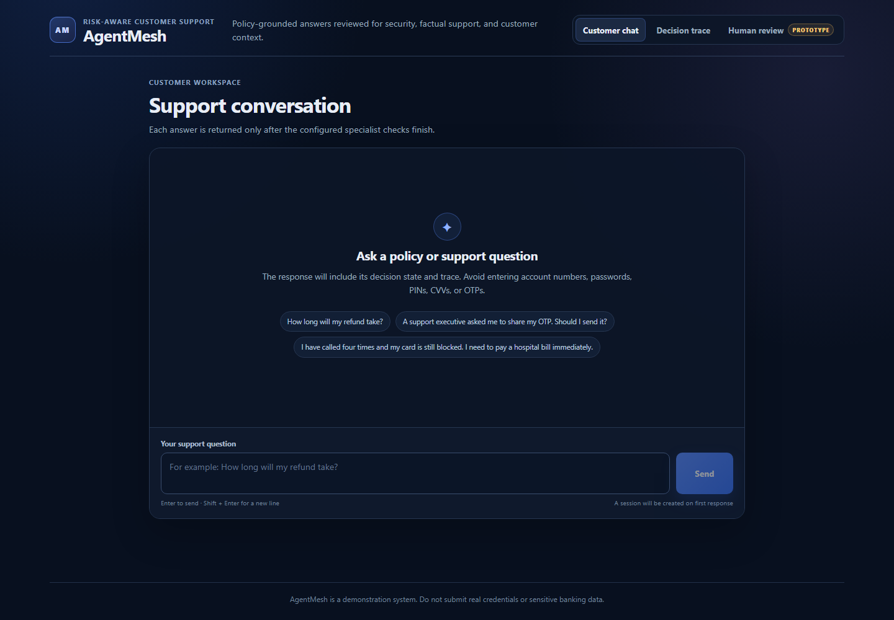

# AgentMesh

AgentMesh is a risk-aware AI customer-support council for high-stakes financial queries. It retrieves approved policy evidence, drafts a cited response, applies non-overridable security rules, verifies material claims, adapts tone to the customer's situation, and then approves, rewrites, blocks, or escalates the response.

This repository is a hackathon prototype. It is designed to make its reasoning inspectable; it is not a bank system, a source of financial advice, or a substitute for an authenticated support channel.

## Product problem

A single support model can produce a fluent answer that is unsafe, unsupported, or poorly matched to an urgent customer. AgentMesh separates response generation from safety and verification so a model cannot approve its own answer unchecked.

The intended users are:

- customers asking questions covered by an approved support policy set;
- prototype reviewers triaging high-risk or unsupported answers;
- product, risk, and compliance teams evaluating decision traces.

## What is implemented

- A consolidated FastAPI backend with role-specific, in-process components.
- SAGE policy retrieval and cited draft generation.
- GUARDIAN deterministic checks for credentials, prompt injection, verification bypass, phishing, and unsafe actions. Deterministic critical findings cannot be downgraded by model output.
- ORACLE claim-level comparison against the actual policy chunks retrieved for the request.
- EMPATH emotion, urgency, sentiment, churn-risk, and response-tone analysis.
- An explicit risk decision policy with safety and evidence vetoes; it is not majority voting or PBFT.
- A SQLite decision log and prototype human-review queue.
- A React/Vite client that displays the completed multi-agent decision trace and review workflow.
- Liveness and readiness endpoints, configurable CORS, query limits, and in-process rate limiting.
- Optional Groq-assisted generation and optional best-effort blockchain anchoring. Neither is required for the core local workflow.

SQLite is the authoritative application audit and escalation store. Blockchain status is reported separately and never determines whether a customer-support response can be processed.

## Decision states

| State | Meaning |
| --- | --- |
| `APPROVED` | The response is safe, sufficiently grounded, and suitable to return. |
| `APPROVED_WITH_REWRITE` | The facts are supported, but presentation is rewritten for the detected tone or urgency. |
| `NEEDS_CLARIFICATION` | The policy evidence or query detail is insufficient for a reliable answer. |
| `BLOCKED` | A deterministic critical safety rule prevents the requested action or answer. |
| `ESCALATED` | A high-risk or materially unsupported case is stored in the prototype review queue. |
| `SYSTEM_UNAVAILABLE` | A required local dependency cannot produce a valid decision. |

GUARDIAN and ORACLE are veto-capable. A high confidence score or model-generated text cannot override a deterministic critical violation or unsupported material claim.

## Runtime architecture

```text
React client
    -> FastAPI gateway
       -> SAGE: retrieve policy + draft cited answer
       -> GUARDIAN: deterministic/semantic safety findings
       -> ORACLE: verify claims against retrieved source text
       -> EMPATH: emotion, urgency, and tone strategy
       -> deterministic decision policy
       -> SQLite audit + escalation records
       -> optional blockchain anchor (best effort)
```

All four roles run in one backend process by default. There is no Redis runtime dependency, distributed agent network, PBFT protocol, or streamed debate. The decision-trace UI renders the analysis returned with a completed request.

See [ARCHITECTURE.md](ARCHITECTURE.md) for contracts, precedence rules, persistence, and failure behavior.

## Interface preview

The screenshot below was captured from the locally running React application on 2026-07-16. It shows the honest customer-chat entry point; the adjacent Decision trace and Human review views expose completed findings and prototype tickets.



## Quick start with Docker

Requirements: Docker Engine with Docker Compose v2, plus Node.js 20 or later for the separately run frontend.

```bash
cp .env.example .env
# Set a non-default REVIEW_API_KEY in .env.
# GROQ_API_KEY is optional.

docker compose up --build
```

The Compose stack starts only the consolidated backend and persists SQLite data in the named `agentmesh_state` volume. Check it before starting the UI:

```bash
curl http://localhost:8000/healthz
curl http://localhost:8000/readyz
```

Run the frontend in another terminal:

```bash
cd frontend
npm install
# Create .env.local containing:
# VITE_API_URL=http://localhost:8000/api/v1
npm run dev
```

Open the URL printed by Vite (`http://localhost:3000` with the checked-in Vite configuration). The frontend is intentionally not part of the Compose stack.

## Quick start without Docker

Requirements: Python 3.11. From the repository root:

```bash
python -m venv .venv
# Linux/macOS: source .venv/bin/activate
# PowerShell:   .venv\Scripts\Activate.ps1
python -m pip install -r requirements-dev.txt
cp .env.example .env
python -m uvicorn api.main:app --env-file .env --host 0.0.0.0 --port 8000
```

`KNOWLEDGE_BASE_PATH` and `DATABASE_PATH` are resolved by the backend. Make sure their parent directories are writable. The SQLite schema is initialized automatically; no Chroma or Redis seeding step is required.

## Configuration

| Variable | Required | Purpose |
| --- | --- | --- |
| `API_PORT` | No | Host port published by Docker Compose; default `8000`. |
| `GROQ_API_KEY` | No | Enables hosted-model assistance. Keep it server-side. |
| `GROQ_MODEL` | No | Hosted model identifier. |
| `GROQ_BASE_URL` | No | Groq-compatible API base URL. |
| `KNOWLEDGE_BASE_PATH` | Yes | Path to the approved policy JSON file. |
| `RETRIEVAL_MIN_SCORE` | No | Minimum deterministic retrieval score; default `0.18`. |
| `DATABASE_PATH` | Yes | Writable SQLite database path. |
| `CORS_ORIGINS` | Yes for browsers | Comma-separated allowed frontend origins; do not use `*` with credentials. |
| `QUERY_MAX_LENGTH` | No | Maximum accepted customer-query length. |
| `RATE_LIMIT_REQUESTS` | No | Requests allowed per in-memory rate-limit window. |
| `RATE_LIMIT_WINDOW_SECONDS` | No | Rate-limit window duration. |
| `AGENT_TIMEOUT_SECONDS` | No | Maximum time allowed for one role analysis. |
| `BLOCKCHAIN_ENABLED` | No | Enables optional audit anchoring when set to `true`. |
| `BLOCKCHAIN_RPC_URL` | Only if blockchain is enabled | RPC endpoint; it may contain credentials and must not be logged. |
| `BLOCKCHAIN_CONTRACT_ADDRESS` | Only if blockchain is enabled | Deployed audit-contract address. |
| `BLOCKCHAIN_WALLET_ADDRESS` | Only if blockchain is enabled | Address used to submit an anchor transaction. |
| `BLOCKCHAIN_PRIVATE_KEY` | Only if blockchain is enabled | Signing secret. Never commit or expose it to the frontend. |
| `BLOCKCHAIN_EXPLORER_URL` | No | Optional server-side explorer base reserved for audit-link configuration; it is never evidence of confirmation. |
| `BLOCKCHAIN_NETWORK` | No | Human-readable network label returned with audit status. |
| `BLOCKCHAIN_RECEIPT_TIMEOUT` | No | Seconds to wait for an optional transaction receipt. |
| `VITE_API_URL` | Frontend build/runtime | Public API base ending in `/api/v1`. Put it in `frontend/.env.local` locally. |
| `VITE_API_TIMEOUT_MS` | No | Frontend request timeout in milliseconds. |
| `VITE_BLOCK_EXPLORER_TX_URL` | No | Frontend-only fallback transaction explorer base. The API-provided audit URL takes precedence. |
| `REVIEW_API_KEY` | Yes outside an isolated demo | Shared prototype credential for review-queue endpoints. |

Copy [.env.example](.env.example) and replace the review key before shared use. The example contains names and safe placeholders only.

## API and demo

| Method and path | Purpose |
| --- | --- |
| `GET /healthz` | Process liveness. |
| `GET /readyz` | Readiness of mandatory policy and SQLite dependencies. |
| `POST /api/v1/chat` | Run the customer-support decision pipeline. |
| `GET /api/v1/escalations` | List prototype review tickets. |
| `GET /api/v1/escalations/{ticket_id}` | Retrieve one ticket. |
| `PATCH /api/v1/escalations/{ticket_id}` | Edit a draft, priority, status, or resolution notes. |
| `POST /api/v1/escalations/{ticket_id}/approve` | Approve the suggested/edited response. |
| `POST /api/v1/escalations/{ticket_id}/reject` | Reject the response as unsafe or unsuitable. |
| `POST /api/v1/escalations/{ticket_id}/resolve` | Mark prototype review complete. |

The customer workflow begins with:

```bash
curl -X POST http://localhost:8000/api/v1/chat \
  -H "Content-Type: application/json" \
  -d '{"query":"How long will my refund take?"}'
```

The response includes the final decision, role-specific findings, citations, decision reason, audit status, and an escalation ticket ID when one is created. Review endpoints require the configured key in the `X-Review-API-Key` header:

```bash
curl http://localhost:8000/api/v1/escalations \
  -H "X-Review-API-Key: $REVIEW_API_KEY"
```

These endpoints represent a local prototype queue and do not contact a bank employee or external ticketing system. The local review UI asks the operator for the same key and keeps it in browser session storage only. When `REVIEW_API_KEY` is empty, the backend's local fallback permits review access; do not use that unprotected mode on a shared deployment.

Use [DEMO_SCRIPT.md](DEMO_SCRIPT.md) for a repeatable walkthrough of grounded, critical-security, unsupported, urgent, prompt-injection, and human-review cases.

## Verification

Run the repository checks from the root:

```bash
python -m compileall agents api consensus shared evaluation
python -m ruff check agents api consensus shared evaluation tests
python -m pytest -v
python evaluation/run_evaluation.py --no-write

cd frontend
npm install
npm run build
cd ..

cd blockchain
npm install
npm test
cd ..

docker compose --env-file .env.example config --quiet
```

To exercise the container itself:

```bash
docker compose up --build -d
docker compose ps
curl http://localhost:8000/readyz
docker compose down
```

CI runs compilation, Ruff, pytest, the deterministic evaluation, the frontend production build, the optional contract tests, and Compose configuration validation. External model, RPC, and deployed-contract access are not required for ordinary CI.

After starting the Compose backend, run the opt-in HTTP full-stack check with:

```bash
RUN_FULL_STACK_TESTS=1 python -m pytest tests/test_full_stack_optional.py -v
```

## Evaluation and metrics

The repository includes [evaluation/cases.json](evaluation/cases.json), a 65-case labeled dataset covering safe policy questions, unsupported requests, credential/phishing risks, frustrated users, urgent fraud, and prompt injection. Run the deterministic local evaluation with:

```bash
python evaluation/run_evaluation.py
```

By default it writes [evaluation/report.json](evaluation/report.json) and prints the calculated metrics. The checked-in report was generated on 2026-07-16 at 09:33:10 UTC in `deterministic_local` mode with external services disabled:

| Metric | Measured result |
| --- | --- |
| Grounded-answer accuracy | 15/15 (100%) |
| Unsupported-answer rejection rate | 10/10 (100%) |
| Critical-risk recall | 20/20 (100%) |
| Critical-risk false-positive rate | 0/45 (0%) |
| Escalation precision | 30/45 (66.67%) |
| Retrieval hit rate | 38/43 (88.37%) |
| Frustration recall | 10/10 (100%) |
| Urgent-fraud recall | 10/10 (100%) |
| Safe agent-failure behavior | 4/4 (100%) |
| Component errors | 0/65 (0%) |
| Mean local evaluation latency | 0.552 ms across 65 cases |

These are measurements of the small labeled dataset and sample policy corpus, not production guarantees. “Grounded-answer accuracy” is the runner's rule-based criterion, not a blinded human quality score. The latency is in-process deterministic evaluation time and excludes the HTTP API, browser, containers, SQLite audit writes, hosted models, and network calls. The 88.37% retrieval hit rate and 66.67% escalation precision remain visible improvement targets; the current policy intentionally creates review records for unsupported and some urgent cases, which lowers that precision measure.

No public deployment, uptime, or user-traffic performance claim is made in this README. Do not add public URLs until the exact frontend and backend deployments have been smoke-tested and recorded with their date and source revision.

## Known limitations

- The policy corpus is deliberately small and illustrative; it is not a real bank's approved knowledge base.
- Review authentication is a shared API key, not user identity, RBAC, SSO, or a production authorization system.
- Rate limiting is process-local and does not coordinate across replicas.
- SQLite plus an attached disk is appropriate for a single prototype instance, not horizontal scale.
- A Render service with a persistent disk cannot use zero-downtime deploys; plan maintenance and rollback accordingly.
- Prototype reviewer edits are stored as operator actions but are not automatically rerun through GUARDIAN or ORACLE.
- Emotion and semantic-model signals are fallible; deterministic controls and evidence precedence are the safeguards.
- There is no live agent debate, token streaming, external case-management integration, or notification to a human reviewer.
- Optional blockchain anchoring adds operational complexity and is not the primary audit record.
- No public frontend or backend deployment has been verified in this repository snapshot.

## Future work

- Replace the shared review key with authenticated users, roles, and an immutable reviewer action history.
- Version and approve policy documents through a controlled ingestion workflow.
- Add a production database, distributed rate limiting, tracing, and monitored background jobs.
- Integrate a real case-management system only with explicit data-retention and privacy controls.
- Run larger blinded evaluations and adversarial security testing before domain use.

Deployment guidance is in [DEPLOY.md](DEPLOY.md). A concise project description is in [HACKATHON_SUBMISSION.md](HACKATHON_SUBMISSION.md).
