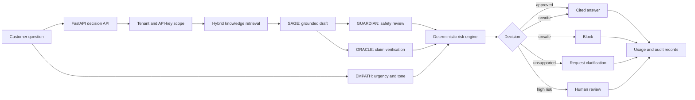
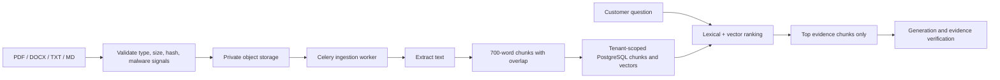

# AgentMesh

[](https://github.com/DRDev-coder/AgentMesh/actions/workflows/ci.yml)


**Trustworthy customer-support AI, grounded in company knowledge and verified before it reaches customers.**

[Live staging app](https://agentmesh-web.livelysmoke-efb633a4.centralindia.azurecontainerapps.io) | [OpenAPI contract](docs/openapi.json) | [Architecture](ARCHITECTURE.md) | [Deployment guide](DEPLOY.md)

AgentMesh is a multi-tenant B2B SaaS platform that helps businesses deploy trustworthy customer-facing AI agents grounded in their own knowledge. Companies upload policies and documents, test responses instantly in a no-key playground, then integrate the same intelligence through secure API keys. Its multi-agent pipeline retrieves relevant evidence, generates answers, verifies safety and factual accuracy, provides citations, and tracks usage. AgentMesh transforms AI prototypes into auditable, scalable, production-ready experiences with control.

> **Hackathon track:** Support Chat Bot
>
> **Current scope:** English-language informational customer support
>
> **Staging note:** The public Azure deployment scales to zero, so the first request can take longer while its containers start.

## The problem

A fluent AI response is not automatically a trustworthy response. A normal chatbot can invent a policy, reveal unsafe instructions, answer from the wrong company's data, or confidently present a claim that its source does not support.

AgentMesh puts an application-controlled decision layer around generation:

- company knowledge is isolated, versioned, and retrieved as evidence;
- safety and factual-support checks can veto the generated draft;
- unsupported answers fail closed instead of being shown as facts;
- every completed decision carries citations, a trace, and usage metadata;
- teams can test in the dashboard, then use the same behavior from their own product through an API key.

## Product journey

| Step | What a company can do |
| --- | --- |
| 1. Create a workspace | Sign up, create an organization, invite teammates, and assign roles. |
| 2. Add company knowledge | Upload PDF, DOCX, TXT, or Markdown policies and preview the extracted chunks. |
| 3. Publish safely | Create an immutable knowledge release; test keys can use drafts while live keys use published releases only. |
| 4. Test without a key | Ask real customer questions in the signed-in Playground. AgentMesh creates a scoped test principal behind the scenes. |
| 5. Integrate by API | Generate a one-time-reveal test or live key and call the idempotent decision endpoint. |
| 6. Operate and improve | Inspect evidence and agent traces, review escalations, manage usage, webhooks, team access, and billing. |

## How it works



### The four-agent council

| Agent | Responsibility | Output used by the decision engine |
| --- | --- | --- |
| **SAGE** | Retrieves workspace evidence and drafts a concise answer with Groq, or a deterministic fallback. | Draft, retrieval quality, generation mode, and controlled citations. |
| **GUARDIAN** | Detects credential requests, prompt injection, policy bypasses, sensitive-data risks, and other unsafe content. | Safety status, rule findings, blocking signal, and safe guidance. |
| **ORACLE** | Splits the draft into material claims and checks each one against the retrieved evidence. | Supported and unsupported claims plus an approval recommendation. |
| **EMPATH** | Detects emotion and urgency without changing the underlying facts. | Tone strategy, urgency score, churn risk, and escalation signal. |

The final outcome is not a majority vote. A deterministic risk engine gives safety and evidence checks veto power and returns one of six explicit states:

| State | Meaning |
| --- | --- |
| `APPROVED` | Grounded, cited, and safe to show. |
| `APPROVED_WITH_REWRITE` | Grounded and safe, with fact-preserving tone adaptation. |
| `NEEDS_CLARIFICATION` | Evidence is missing or does not support every material claim. |
| `BLOCKED` | A security or safety control rejected the request. |
| `ESCALATED` | Human review is required because of risk, urgency, or a warning. |
| `SYSTEM_UNAVAILABLE` | A required dependency failed, so no answer was approved or billed. |

## Knowledge and RAG pipeline



AgentMesh does not send the entire uploaded document to the model. It stores the original in private object storage, extracts and chunks its text, creates deterministic 384-dimensional `hashing-v1` vectors, and stores each chunk with tenant IDs and provenance. At decision time, retrieval combines lexical relevance and vector cosine similarity, then sends only the top evidence chunks to the generation and verification pipeline.

Knowledge releases are immutable. This makes a decision reproducible: its trace records the exact workspace profile, knowledge release, model identifier, and citations used at that time.

## What makes AgentMesh different

- **Grounding is enforced, not requested.** ORACLE checks the draft after generation; a prompt saying "use the context" is not the only protection.
- **Safety lives outside the model.** Mandatory GUARDIAN rules and decision precedence cannot be disabled by workspace prompts.
- **Multi-company isolation is part of the data model.** Organization and workspace IDs scope database queries, object keys, releases, API keys, decisions, and usage.
- **Playground and API share the same decision path.** A successful dashboard demo represents the behavior an integration receives.
- **Test and live environments are distinct.** Test keys can use draft configuration; live keys are restricted to active published releases.
- **The API is operationally usable.** Keys are scoped and revocable, requests are idempotent, limits are distributed through Redis, and completed decisions are metered.
- **Failures are visible and fail closed.** Missing evidence or unavailable verification produces a safe state, not an unverified model answer.

## Evaluation evidence

The checked-in multi-company evaluation exercises ten isolated company workspaces using paraphrased public support policies. It validates document ingestion, release publication, grounded Playground answers, API-key answers, and cross-company isolation.

| Evaluation | Result |
| --- | ---: |
| Companies tested | 10 |
| Workflow checks passed | **30 / 30** |
| Grounded questions passed | **10 / 10** |
| Cross-company leakage observed | **0** |
| API-key decisions passed | **10 / 10** |

See the [Groq workflow report](evaluation/company_workflow_report_groq.md), [deterministic workflow report](evaluation/company_workflow_report_deterministic.md), and [asynchronous ingestion smoke report](evaluation/async_ingestion_smoke_report.json). These results describe the committed evaluation fixtures; they are not a production accuracy or latency benchmark.

## Technology stack

| Layer | Technology |
| --- | --- |
| Frontend | React 18, TypeScript, Vite, React Router, TanStack Query, Zod |
| API | FastAPI, Pydantic, SQLAlchemy, Alembic |
| AI | Groq API, evidence-grounded generation, deterministic claim and safety checks |
| Data | PostgreSQL 16, pgvector-compatible schema, Redis |
| Jobs | Celery worker and Celery Beat |
| Storage | MinIO/S3 locally; S3-compatible or Azure Blob storage when deployed |
| Authentication | Supabase Auth in staging/production; development identity headers locally |
| Billing and email | Razorpay subscriptions and Resend transactional email |
| Infrastructure | Docker Compose, Azure Container Apps, GitHub Container Registry |
| Quality | Pytest, Ruff, Vitest, Playwright, generated OpenAPI TypeScript types |

## Run locally

### Prerequisites

- Docker Desktop with Docker Compose
- Node.js 22 and npm
- Optional: a Groq API key for model-generated answers

### 1. Start the backend stack

```bash
git clone https://github.com/DRDev-coder/AgentMesh.git
cd AgentMesh
cp .env.example .env
```

Add a Groq key to the ignored `.env` file if model-backed answers are required:

```dotenv
GROQ_API_KEY=your_groq_key
```

Then start PostgreSQL, Redis, MinIO, migrations, the FastAPI gateway, worker, and scheduler:

```bash
docker compose up --build
```

Verify the API:

```bash
curl http://localhost:8000/healthz
curl http://localhost:8000/readyz
```

### 2. Start the frontend

```bash
cd frontend
npm install
npm run dev
```

Open [http://localhost:3000](http://localhost:3000). Local development uses a safe development identity flow, so Supabase email verification is not required for the local demo.

### 3. Run the core demo

1. Create an organization and workspace.
2. Upload a non-sensitive Markdown, TXT, PDF, or DOCX policy.
3. Wait for `READY_FOR_REVIEW`, preview the extracted chunks, and publish a release.
4. Open Playground and ask a question answered by the uploaded policy.
5. Inspect the decision state, citation, usage unit, and agent trace.
6. Create a test API key and repeat the question through `POST /api/v1/decisions`.

## Public decision API

API keys are shown once and stored only as keyed digests. The key itself selects its organization, workspace, environment, and scopes, so callers never submit tenant IDs.

```bash
curl -X POST http://localhost:8000/api/v1/decisions \
  -H "Authorization: Bearer am_test_<public-id>.<secret>" \
  -H "Idempotency-Key: demo-request-001" \
  -H "Content-Type: application/json" \
  -d '{
    "input": "Can I return an unopened jacket after 20 days?",
    "session_id": "demo-session",
    "end_user_id": "customer-123",
    "metadata": {"channel": "website"}
  }'
```

A response contains the approved answer or safe fallback, decision state and reason, controlled citations, optional scoped trace, escalation ID, usage units, and timestamp.

`Idempotency-Key` makes retries safe: the same key and body return the original decision without consuming another usage unit; reusing the key with a different body returns `409`.

FastAPI generates the [OpenAPI JSON contract](docs/openapi.json), and `openapi-typescript` generates [frontend/src/generated/api.ts](frontend/src/generated/api.ts). This keeps frontend request and response types synchronized with the backend.

## Multi-tenancy and security

- PostgreSQL row-level security is enabled and tested with a restricted non-superuser role.
- Every tenant-owned record is scoped to an organization and, where relevant, a workspace.
- Roles include owner, admin, developer, reviewer, and viewer.
- API keys use `am_test_` and `am_live_` prefixes, one-time reveal, keyed-digest storage, scopes, expiry, revocation, and Redis-backed rate limits.
- Sensitive input is rejected before model processing; source files are validated, deduplicated, and stored privately.
- Customer webhooks use timestamped HMAC signatures and retain retry history.
- Audit events are immutable and hash chained in PostgreSQL.
- Raw decision content follows configurable retention and redaction workflows.
- Platform administration requires a verified Supabase identity and MFA level `aal2`.

Never commit `.env`, provider keys, database credentials, webhook secrets, or generated deployment manifests. Browser-exposed `VITE_*` variables must contain public configuration only.

## Repository map

```text
agents/                 SAGE, GUARDIAN, ORACLE, and EMPATH roles
api/                    FastAPI routes, tenancy, persistence, jobs, and integrations
consensus/              Deterministic risk-aware decision policy
frontend/               React and TypeScript SaaS dashboard
migrations/             Alembic schema and PostgreSQL RLS migrations
evaluation/             Deterministic and Groq workflow runners and reports
data/evaluation/        Isolated multi-company evaluation fixtures
docs/                   Generated OpenAPI contract
infra/azure/            Azure student-staging deployment notes
tests/                  Backend, security, tenancy, and workflow tests
docker-compose.yml      Complete local service topology
```

## Verification

The GitHub Actions workflow runs PostgreSQL and Redis services and verifies migrations, restricted-role RLS, backend behavior, deterministic evaluation, generated contracts, frontend tests, the production build, a Playwright browser journey, the optional audit contract, and Docker Compose configuration.

Run the same core checks locally:

```bash
python -m pip install -r requirements-dev.txt
alembic upgrade head
python -m compileall agents api consensus shared evaluation
python -m ruff check agents api consensus shared evaluation tests
python -m pytest -q
python evaluation/run_evaluation.py --no-write
python -m api.export_openapi

cd frontend
npm ci
npm run generate:api
npm run typecheck
npm run test
npm run build
npm run test:e2e
```

## Deployment status

The public hackathon staging environment runs the frontend and API on Azure Container Apps Consumption with scale-to-zero containers, Supabase Auth and PostgreSQL, Azure Blob Storage, and public images from GitHub Container Registry.

- [Staging frontend](https://agentmesh-web.livelysmoke-efb633a4.centralindia.azurecontainerapps.io)
- [Staging API health](https://agentmesh-api.livelysmoke-efb633a4.centralindia.azurecontainerapps.io/healthz)
- [Azure staging topology and limitations](infra/azure/README.md)

This is intentionally a low-cost staging topology, not a production SLA. Production requires durable managed Redis, independently scaled workers and scheduler, malware scanning, observability and alerting, tested backup restoration, complete Razorpay configuration, and validated cost controls.

## Responsible scope

AgentMesh is an informational-support platform and hackathon MVP. It is not approved for medical, financial, legal, or other regulated decisions. Do not upload PHI, payment-card data, bank credentials, production secrets, or unreviewed sensitive customer data. The repository makes no HIPAA, PCI DSS, medical, or financial-regulatory compliance claim.

## Documentation

- [System architecture](ARCHITECTURE.md)
- [Deployment runbook](DEPLOY.md)
- [Azure staging notes](infra/azure/README.md)
- [Generated OpenAPI contract](docs/openapi.json)
- [Implementation report](IMPLEMENTATION_REPORT.md)

---

Built for the hackathon with one goal: make company AI useful enough to deploy and controlled enough to trust.
